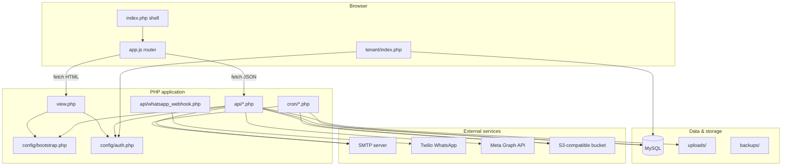
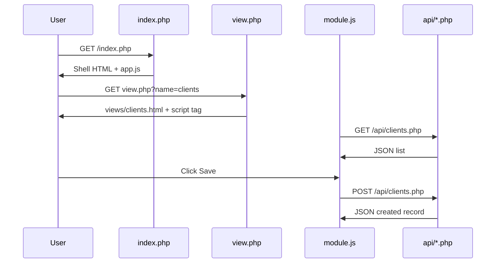
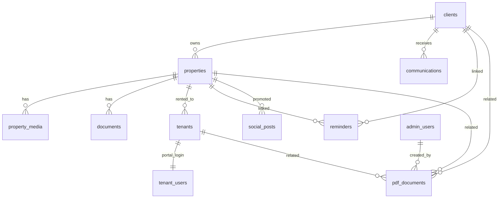
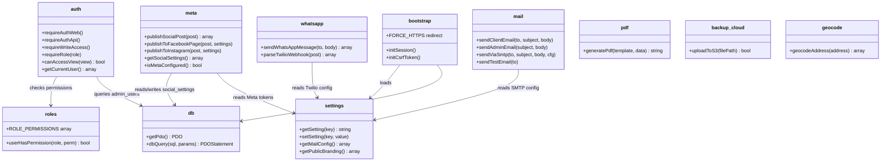
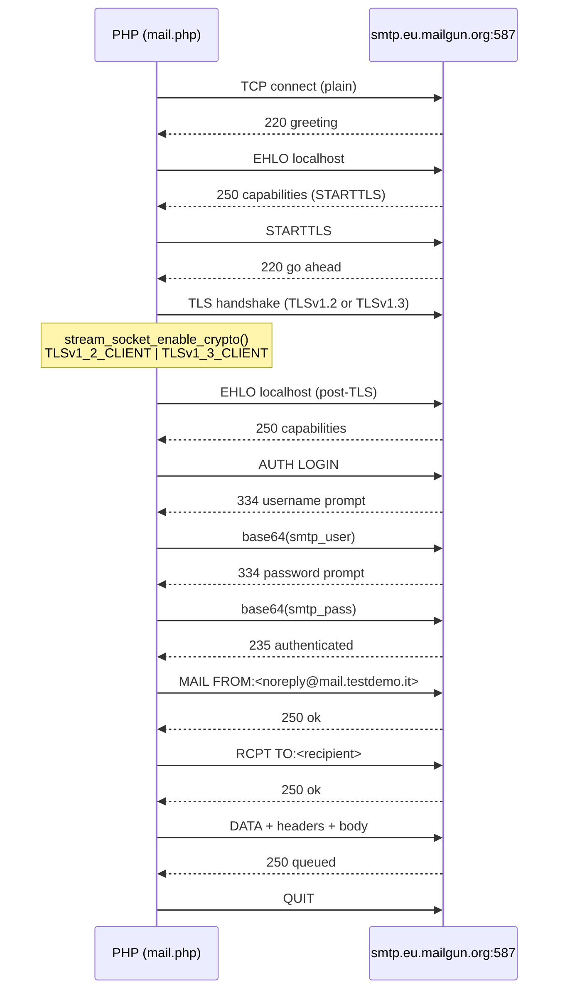
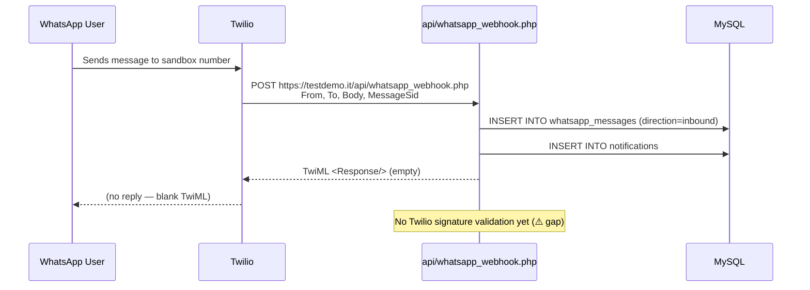
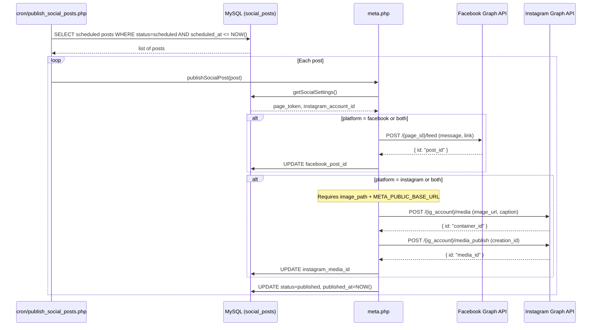
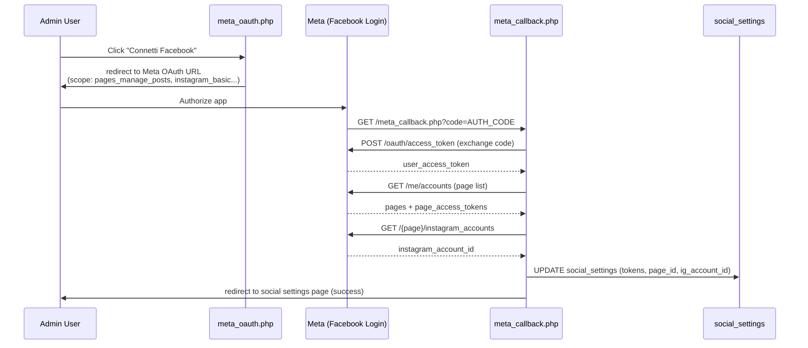

# Gestionale Immobiliare — Architecture

> **Live at:** https://testdemo.it — Hetzner VPS + Coolify + Traefik  
> **Last updated:** June 2026

Real estate agency admin dashboard for managing owners (*proprietari*), properties (*immobili*), documents, communications, reminders, tenants (*inquilini*), and social media. Built as a **classic PHP monolith** with a **MySQL** backend and a **vanilla JavaScript** frontend loaded via AJAX.

---

## Tech stack

| Layer | Technology | Status |
|-------|------------|--------|
| Runtime | PHP 8.3 (Apache + mod_rewrite) | ✅ |
| Database | MySQL 8 — Coolify container named `default` | ✅ |
| Frontend | HTML partials, CSS, vanilla JS (no framework) | ✅ |
| Auth | PHP sessions (separate cookies for admin vs tenant) | ✅ |
| Config | Coolify env vars (production) / `.env` file (local) | ✅ |
| Hosting | Hetzner VPS → Coolify → Docker → Traefik | ✅ |
| DNS | Cloudflare (testdemo.it → 91.99.137.240) | ✅ |
| Email | Mailgun SMTP EU (smtp.eu.mailgun.org:587 STARTTLS) | ✅ |
| WhatsApp | Twilio sandbox | ✅ |
| Social | Meta Graph API (Facebook ✅ / Instagram ✅ with image) | ✅ |
| S3 backup | Cloudflare R2 (planned) | 🔄 in progress |
| Cron | Not yet configured on server | ⚠️ pending |

---

## High-level architecture



The admin app is a **single-page shell** (`index.php`) that never full-page-reloads when switching modules. Each module is an HTML partial plus a dedicated JS file that talks to JSON APIs.

---

## Directory layout

```
├── index.php              # Admin shell (sidebar, topbar, #app-content)
├── login.php / logout.php # Admin authentication
├── setup.php              # One-time first admin creation
├── view.php               # Auth-gated HTML partial loader
├── branding.css.php       # Dynamic CSS variables from DB settings
├── meta_oauth.php         # Meta OAuth redirect start
├── meta_callback.php      # Meta OAuth callback handler
│
├── api/                   # JSON REST-style endpoints (one file per resource)
├── assets/
│   ├── css/style.css      # Global styles + responsive layout
│   └── js/
│       ├── app.js         # Router, fetch wrapper, sidebar
│       └── *.js           # Per-module logic (clients.js, properties.js, …)
├── config/                # Bootstrap, DB, auth, roles, integrations
├── cron/                  # CLI cron scripts (blocked from web via .htaccess)
├── database/
│   ├── schema.sql         # Dev schema with seed data
│   ├── schema_production.sql
│   └── migrations/        # Incremental upgrades (phase3–phase9)
├── lib/                   # SimplePdf and other shared libraries
├── tenant/                # Separate tenant portal (login + dashboard)
├── uploads/               # User-uploaded files (logos, documents, media)
└── views/                 # HTML partials (not served directly)
```

Sensitive paths (`config/`, `database/`, `cron/`, `.env`) are blocked by root `.htaccess`. `views/` has its own deny rule so HTML partials are only reachable through `view.php`.

---

## Request flow — admin dashboard

### 1. Initial page load

1. Browser requests `index.php`.
2. `config/bootstrap.php` loads `.env`, configures errors, optional HTTPS redirect, and starts the admin session.
3. `requireAuthWeb()` redirects unauthenticated users to `login.php`.
4. PHP renders the fixed layout: sidebar navigation, topbar, empty `#app-content`.
5. `assets/js/app.js` runs on `DOMContentLoaded` and calls `loadView('view.php?name=dashboard', 'dashboard')`.

### 2. View navigation (AJAX)

1. User clicks a sidebar link (e.g. *Proprietari*).
2. `app.js` intercepts the click, `fetch`es `view.php?name=clients`.
3. `view.php` checks session auth, validates the view name against an allowlist, and checks `canAccessView()` for role-based access.
4. On success, the raw HTML from `views/clients.html` is injected into `#app-content`.
5. `app.js` re-executes any `<script>` tags in the partial (e.g. `clients.js`), which binds UI events and loads data from APIs.

### 3. API calls

1. Module JS calls `fetch('/api/clients.php')` (or POST/PUT/DELETE with JSON body).
2. `config/api_bootstrap.php` loads bootstrap + DB, calls `requireAuthApi()` (401 if no session).
3. For mutating methods (POST/PUT/PATCH/DELETE), `requireWriteAccess()` blocks `readonly` users.
4. Endpoint handles the request, returns JSON via `apiSuccess()` / `apiError()`.
5. Global `fetch` wrapper in `app.js` redirects to `login.php` on any 401.



---

## Authentication and authorization

### Two separate portals

| Portal | Session cookie | Entry | Users |
|--------|----------------|-------|-------|
| Admin | `gestionale_session` | `login.php` → `index.php` | `admin_users` table |
| Tenant | `gestionale_tenant_session` | `tenant/login.php` → `tenant/index.php` | `tenant_users` + `tenants` |

Admin and tenant sessions use different cookie names so both can coexist without collision. Passwords are stored with `password_hash()` / verified with `password_verify()`.

### Admin roles

Defined in `config/roles.php`:

| Role | Access |
|------|--------|
| `super_admin` | Everything, including Settings and user management |
| `admin` | All modules except Settings |
| `agent` | Operational modules (no Social, no Settings) |
| `readonly` | View-only; GET APIs work, writes return 403 |

Navigation items and `view.php` use `canAccessView()`. Individual APIs can add `requireViewAccess()` or `requireRole()` for finer control (e.g. `api/admin_users.php` is super-admin only).

### First-time setup

1. Import `database/schema_production.sql` (or run migrations).
2. Set `SETUP_ENABLED=true` in `.env`.
3. Visit `setup.php` once to create the first `super_admin`.
4. A `.setup_complete` lock file is written; set `SETUP_ENABLED=false` in production.

### Cron and job triggers

Background work can run two ways:

- **CLI** (`php cron/process_reminders.php`) — no auth check.
- **HTTP** (`api/process_reminders.php`) — requires either a logged-in admin with write access, or `CRON_SECRET` via header `X-Cron-Secret` or query `?secret=`.

---

## API design

Each file under `api/` is a self-contained endpoint. There is no central router; Apache maps URL path to file directly.

### Conventions

- **Response shape:** `{ "success": true, "data": ... }` or `{ "success": false, "error": "..." }`
- **Methods:** REST-like — GET list/detail, POST create, PUT update, DELETE soft-archive
- **Bootstrap:** `require_once '../config/api_bootstrap.php'` (auth + write guard)
- **Helpers:** `config/api_helpers.php` — `apiSuccess`, `apiError`, `apiGetJsonBody`, CORS headers

### Endpoint map

| File | Domain |
|------|--------|
| `clients.php` | Owners (proprietari) |
| `properties.php` | Properties linked to clients |
| `property_media.php` | Photo/video gallery per property |
| `documents.php` | Uploaded files (invoices, contracts, IDs) |
| `communications.php` | Email/WhatsApp message log |
| `reminders.php` | Scheduled reminders |
| `tenants.php` | Tenant records + portal password |
| `social_settings.php` / `social_posts.php` | Meta integration |
| `settings.php` | App settings (branding, SMTP, etc.) |
| `admin_users.php` | Multi-user admin CRUD |
| `generate_pdf.php` / `download_pdf.php` | PDF generation |
| `get_dashboard_stats.php` | Dashboard aggregates |
| `process_reminders.php` / `publish_social_posts.php` | HTTP cron triggers |
| `whatsapp_webhook.php` | Twilio inbound webhook (no session auth) |

File downloads (`download_document.php`, `download_pdf.php`) stream from `uploads/` after auth checks.

---

## Frontend modules

Each admin module follows the same pattern:

1. **`views/<module>.html`** — markup, modals, table skeleton, toolbar; ends with `<script src="assets/js/<module>.js">`.
2. **`assets/js/<module>.js`** — calls `init()` immediately at load (not `DOMContentLoaded`, because the partial is injected after the initial page load).
3. Module JS fetches from the matching `api/<module>.php`, renders table rows, handles forms/modals, shows alerts.

`app.js` exposes `window.App.navigateTo(viewKey, params)` so modules can cross-link (e.g. open a client's properties).

### Responsive behavior

- Sidebar collapses to a hamburger menu on small screens with a backdrop overlay.
- Data tables use `data-label` attributes on `<td>` elements; CSS switches to a card layout on mobile.

### Branding

`branding.css.php` reads `primary_color` and `sidebar_color` from `app_settings` and emits CSS custom properties. The agency name, tagline, and logo path are rendered server-side in `index.php` from `getPublicBranding()`.

---

## Data model

Core entity relationships:



### Key tables

| Table | Purpose |
|-------|---------|
| `clients` | Property owners; soft-delete via `status = archived` |
| `properties` | Listings/units; FK to `clients` |
| `property_media` | Gallery files per property |
| `documents` | Arbitrary uploads linked to client and/or property |
| `communications` | Sent/received messages (email or WhatsApp) |
| `reminders` | Due dates with optional email notifications |
| `tenants` / `tenant_users` | Lease records and portal credentials |
| `social_settings` / `social_posts` | Meta OAuth tokens and scheduled posts |
| `app_settings` | Key-value store for runtime configuration |
| `admin_users` | Dashboard operators with roles |
| `pdf_documents` | Generated PDF metadata |

Fresh installs use `database/schema_production.sql`. Existing databases upgrade via idempotent files in `database/migrations/` (see `database/migrations/README.md`).

---

## Background jobs

| Script | Schedule (suggested) | Action |
|--------|----------------------|--------|
| `cron/process_reminders.php` | Every 15 min | Sends due reminder emails, updates `last_notified_at` |
| `cron/publish_social_posts.php` | Every 5–15 min | Publishes scheduled posts to Facebook/Instagram |
| `cron/backup_database.php` | Daily | mysqldump to `backups/`, optional S3 upload |

Cron scripts use `config/cron_bootstrap.php` (env + DB, no web session). Logic lives in `config/reminders.php`, `config/meta.php`, and `config/backup_cloud.php`.

---

## Integrations

### Email (`config/mail.php`)

SMTP settings come from `app_settings` (editable in Settings UI) with `.env` fallback. Used by reminder processing and outbound communications.

### WhatsApp (`config/whatsapp.php`)

Twilio credentials stored in settings. Outbound messages logged in `communications`. Inbound messages arrive at `api/whatsapp_webhook.php`.

### Meta / Social (`config/meta.php`)

OAuth flow: `meta_oauth.php` → Meta → `meta_callback.php` stores tokens in `social_settings`. Scheduled posts in `social_posts` are published via Graph API.

### PDF (`lib/SimplePdf.php`, `config/pdf.php`)

Server-side PDF generation for contracts and reports. Files saved under `uploads/` with metadata in `pdf_documents`.

### Cloud backup (`config/backup_cloud.php`)

Optional S3-compatible upload of database dumps. Credentials in `app_settings` / `.env`.

---

## Tenant portal

A lightweight separate UI under `tenant/`:

1. Tenant logs in with email + password (`tenant_users.password_hash`).
2. `tenant/index.php` shows lease details and property info for their `tenant_id` only.
3. Uses `initTenantSession()` / `requireTenantAuthWeb()` — completely isolated from admin session.
4. Admins create tenants and set portal passwords via the *Inquilini* module (`api/tenants.php` → `createTenantPortalUser()`).

---

## Configuration

### `.env` (bootstrap secrets)

Loaded by `config/env.php`. Typical keys:

- `DB_HOST`, `DB_NAME`, `DB_USER`, `DB_PASS`
- `APP_ENV`, `APP_DEBUG`, `APP_URL`, `FORCE_HTTPS`
- `SESSION_NAME`, `CRON_SECRET`, `SETUP_ENABLED`
- `ADMIN_USERNAME`, `ADMIN_PASSWORD` (setup only)
- Integration fallbacks: `SMTP_*`, `TWILIO_*`, `META_*`, `BACKUP_S3_*`

### `app_settings` (runtime, UI-editable)

Branding, SMTP, WhatsApp, backup, and Meta app credentials. `config/settings.php` merges DB values over `.env` defaults and caches per request.

---

## Security model

| Concern | Mechanism |
|---------|-----------|
| Direct file access | `.htaccess` blocks `config/`, `database/`, `cron/`, `views/` |
| API auth | Session required; 401 JSON or redirect to login |
| Write protection | `readonly` role blocked on mutating HTTP methods |
| Passwords | `password_hash` / `password_verify` |
| Cron HTTP | Shared secret `CRON_SECRET` |
| Sessions | `httponly`, `samesite=Lax`, `secure` when `FORCE_HTTPS` |
| SQL | PDO prepared statements, `ATTR_EMULATE_PREPARES => false` |
| Uploads | Stored under `uploads/`; served only through authenticated download endpoints |

---

## Local development

Typical setup with MAMP/XAMPP:

1. Copy project to web root (e.g. `htdocs/gestionale`).
2. Create DB and import schema or migrations.
3. Copy `.env.example` → `.env`, set DB credentials.
4. Enable `SETUP_ENABLED=true`, run `setup.php`, then disable.
5. Open `http://localhost/gestionale/index.php`.

> **Note:** Running from OneDrive paths can break Apache on Windows; a local copy under `htdocs` is recommended.

For production deployment steps, see `PRODUCTION_READINESS.md`.

---

## Adding a new module

1. Create `views/myfeature.html` with markup and `<script src="assets/js/myfeature.js">`.
2. Create `assets/js/myfeature.js` with an `init()` function called at file end.
3. Create `api/myfeature.php` using `api_bootstrap.php` and standard JSON helpers.
4. Add the view name to `$allowed` in `view.php`.
5. Add nav link in `index.php` and title in `app.js` `viewTitles`.
6. Add permission in `config/roles.php` `ROLE_PERMISSIONS` if role-gated.
7. Add migration/SQL for any new tables.

This keeps new features consistent with the existing architecture without introducing new frameworks or build steps.

---

## Class diagram — config layer

The `config/` folder is the application's service layer. Each file is a collection of plain PHP functions (no classes), but the logical grouping maps to these responsibilities:



---

## Sequence diagram — email sending (Mailgun STARTTLS)



---

## Sequence diagram — WhatsApp inbound (Twilio webhook)



---

## Sequence diagram — Meta social post publishing



---

## Sequence diagram — Meta OAuth flow


