# Database Documentation — Gestione Immobiliare

> **Engine:** MySQL 8.0  
> **Charset:** utf8mb4_unicode_ci  
> **Production DB name:** `default` (Coolify convention)  
> **Schema file:** `database/schema_production.sql`

---

## Table count summary

40 tables across 8 functional domains:

| Domain | Tables |
|--------|--------|
| Users & Auth | admin_users, tenant_users, login_attempts, activity_log |
| Core Real Estate | clients, properties, buildings, property_media, property_price_history |
| Contracts & Payments | contracts, payments, invoices, stripe_payments, agent_commissions |
| Tenants & Leases | tenants, tenant_users, tenant_surveys, property_applications |
| Communications | communications, whatsapp_messages, whatsapp_templates, email_templates |
| Operations | reminders, appointments, documents, pdf_documents, esign_requests |
| Property Management | expenses, suppliers, property_insurance, property_inventory, property_keys, meter_readings, property_appraisals |
| Social & Config | social_posts, social_settings, leads, lead_property_matches, app_settings, payment_reminder_log |

---

## Full ERD

> This is a simplified ERD showing primary foreign key relationships. Optional nullable FKs are shown as `o--` (zero-or-one).

```mermaid
erDiagram
    %% ── USERS ────────────────────────────────────────────────
    admin_users {
        int id PK
        varchar username UK
        varchar password_hash
        enum role "super_admin|admin|agent|readonly"
        varchar email
        tinyint totp_enabled
        tinyint is_active
    }

    tenant_users {
        int id PK
        int tenant_id FK
        varchar password_hash
    }

    login_attempts {
        int id PK
        varchar ip_address
        tinyint success
        timestamp attempted_at
    }

    activity_log {
        int id PK
        int admin_user_id FK
        enum action "create|update|delete|login|logout"
        varchar entity_type
        int entity_id
        varchar ip_address
    }

    %% ── REAL ESTATE CORE ─────────────────────────────────────
    clients {
        int id PK
        varchar name
        varchar surname
        varchar codice_fiscale
        varchar phone
        varchar email
        enum status "active|inactive|archived"
    }

    buildings {
        int id PK
        varchar name
        varchar address
        varchar city
        int total_units
    }

    properties {
        int id PK
        int client_id FK
        int building_id FK
        varchar address
        varchar city
        enum type "appartamento|villa|ufficio|negozio|box|terreno|altro"
        enum status "disponibile|affittato|venduto|in_trattativa|non_disponibile"
        decimal price_rent
        decimal price_sale
        decimal sqm
        int rooms
    }

    property_media {
        int id PK
        int property_id FK
        enum media_type "photo|video|floor_plan|house_map|attachment"
        varchar file_path
        smallint sort_order
    }

    property_price_history {
        int id PK
        int property_id FK
        decimal old_price
        decimal new_price
        int changed_by FK
        timestamp changed_at
    }

    %% ── CONTRACTS & PAYMENTS ─────────────────────────────────
    contracts {
        int id PK
        int property_id FK
        int tenant_id FK
        int client_id FK
        enum contract_type "locazione|compravendita|preliminare|mandato|altro"
        enum status "draft|sent|signed|expired|cancelled"
        date start_date
        date end_date
        decimal monthly_rent
        decimal deposit
    }

    payments {
        int id PK
        int contract_id FK
        int tenant_id FK
        decimal amount
        enum status "pending|paid|overdue|cancelled"
        date due_date
        date paid_date
        enum payment_method "cash|bonifico|stripe|altro"
    }

    invoices {
        int id PK
        varchar invoice_number UK
        int client_id FK
        int property_id FK
        decimal amount
        decimal vat_rate
        decimal vat_amount "GENERATED"
        decimal total "GENERATED"
        enum status "draft|sent|paid|cancelled"
        date issue_date
        date due_date
    }

    stripe_payments {
        int id PK
        int payment_id FK
        int tenant_id FK
        varchar stripe_session_id UK
        varchar stripe_payment_intent
        decimal amount
        enum status "pending|paid|failed|refunded"
    }

    agent_commissions {
        int id PK
        int admin_user_id FK
        int contract_id FK
        int property_id FK
        int client_id FK
        decimal amount
        decimal percentage
        enum commission_type "vendita|locazione|affitto|gestione|altro"
        enum status "pending|paid"
    }

    %% ── TENANTS ──────────────────────────────────────────────
    tenants {
        int id PK
        varchar name
        varchar surname
        varchar email
        varchar phone
        enum status "active|inactive|archived"
    }

    tenant_surveys {
        int id PK
        int tenant_id FK
        int property_id FK
        tinyint overall_rating
        tinyint maintenance_rating
        tinyint communication_rating
        varchar token UK
        timestamp submitted_at
    }

    property_applications {
        int id PK
        int property_id FK
        int lead_id FK
        enum status "pending|approved|rejected|withdrawn"
        text notes
    }

    %% ── LEADS ────────────────────────────────────────────────
    leads {
        int id PK
        varchar name
        varchar surname
        enum interest_type "affitto|acquisto|entrambi"
        decimal budget_min
        decimal budget_max
        varchar preferred_city
        enum status "new|contacted|interested|negotiating|converted|lost"
        enum source "telefono|email|web|passaparola|social|altro"
        int assigned_to FK
    }

    lead_property_matches {
        int lead_id FK
        int property_id FK
    }

    %% ── COMMUNICATIONS ───────────────────────────────────────
    communications {
        int id PK
        int client_id FK
        enum direction "sent|received"
        enum channel "email|whatsapp"
        varchar subject
        enum status "draft|sent|delivered|failed|received"
    }

    whatsapp_messages {
        int id PK
        enum direction "inbound|outbound"
        varchar from_number
        varchar to_number
        text body
        varchar twilio_sid
        int client_id FK
        int tenant_id FK
        tinyint is_read
    }

    whatsapp_templates {
        int id PK
        varchar name
        enum category "benvenuto|scadenza|pagamento|visita|generico"
        text body
        text variables "JSON array"
    }

    email_templates {
        int id PK
        varchar name
        enum category "benvenuto|scadenza_contratto|scadenza_affitto|promemoria|richiesta_documento|generico"
        varchar subject
        text body
        tinyint is_active
    }

    %% ── OPERATIONS ───────────────────────────────────────────
    reminders {
        int id PK
        varchar title
        datetime reminder_date
        enum frequency "once|weekly|biweekly|monthly|quarterly|yearly"
        enum status "pending|completed|cancelled"
        int client_id FK
        int tenant_id FK
        int property_id FK
        int supplier_id FK
        enum maintenance_status "aperta|in_lavorazione|completata|chiusa"
        tinyint notify_admin
        tinyint notify_client
        datetime last_notified_at
    }

    appointments {
        int id PK
        int property_id FK
        int lead_id FK
        int client_id FK
        int agent_id FK
        datetime appointment_date
        enum status "scheduled|completed|cancelled|no_show"
    }

    documents {
        int id PK
        enum doc_type "invoice|contract|id|id_front|id_back|other"
        int client_id FK
        int property_id FK
        int contract_id FK
        varchar file_path
        varchar original_name
        varchar mime_type
    }

    pdf_documents {
        int id PK
        enum doc_type
        int client_id FK
        int property_id FK
        int tenant_id FK
        int admin_user_id FK
        varchar file_path
        varchar title
    }

    esign_requests {
        int id PK
        int document_id FK
        int contract_id FK
        varchar signer_name
        varchar signer_email
        varchar token UK
        enum status "pending|signed|expired"
        timestamp signed_at
        timestamp expires_at
    }

    %% ── PROPERTY MANAGEMENT ──────────────────────────────────
    expenses {
        int id PK
        int property_id FK
        int client_id FK
        int supplier_id FK
        enum category "manutenzione|utenze|tasse|assicurazione|agenzia|altro"
        decimal amount
        date expense_date
    }

    suppliers {
        int id PK
        varchar name
        enum category "idraulico|elettricista|muratore|falegname|imbianchino|giardiniere|pulizie|altro"
        varchar phone
        varchar email
        tinyint rating "1-5"
        tinyint is_active
    }

    property_insurance {
        int id PK
        int property_id FK
        varchar policy_number
        varchar insurer
        decimal premium
        date start_date
        date end_date
        enum status
    }

    property_inventory {
        int id PK
        int property_id FK
        varchar item_name
        varchar condition
        int quantity
        text notes
    }

    property_keys {
        int id PK
        int property_id FK
        int holder_id FK "admin_users"
        varchar holder_name "external holder"
        enum status "out|in_office|lost"
        date handed_at
        date returned_at
    }

    meter_readings {
        int id PK
        int property_id FK
        int tenant_id FK
        enum meter_type
        decimal reading
        date reading_date
    }

    property_appraisals {
        int id PK
        int property_id FK
        decimal estimated_value
        varchar appraiser
        date appraisal_date
        text notes
    }

    %% ── SOCIAL & CONFIG ──────────────────────────────────────
    social_posts {
        int id PK
        int property_id FK
        enum platform "facebook|instagram|both"
        text caption
        varchar image_path
        datetime scheduled_at
        datetime published_at
        enum status "draft|scheduled|published|failed"
        varchar facebook_post_id
        varchar instagram_media_id
        text error_message
    }

    social_settings {
        tinyint id PK "always 1"
        varchar meta_app_id
        varchar meta_user_token
        varchar facebook_page_id
        varchar facebook_page_token
        varchar instagram_account_id
        datetime token_expires_at
    }

    app_settings {
        varchar setting_key PK
        text setting_value
    }

    payment_reminder_log {
        int id PK
        int payment_id FK
        varchar channel "email|whatsapp"
        varchar status
        timestamp sent_at
    }

    %% ── RELATIONSHIPS ────────────────────────────────────────
    admin_users ||--o{ activity_log : logs
    admin_users ||--o{ agent_commissions : earns
    admin_users ||--o{ pdf_documents : creates
    admin_users ||--o{ property_price_history : changes

    clients ||--o{ properties : owns
    clients ||--o{ contracts : party_to
    clients ||--o{ communications : receives
    clients ||--o{ reminders : linked
    clients ||--o{ documents : has
    clients ||--o{ expenses : incurs
    clients ||--o{ invoices : billed
    clients ||--o{ agent_commissions : linked
    clients ||--o{ whatsapp_messages : linked

    buildings ||--o{ properties : contains

    properties ||--o{ property_media : has
    properties ||--o{ property_price_history : tracks
    properties ||--o{ contracts : subject_of
    properties ||--o{ documents : has
    properties ||--o{ reminders : linked
    properties ||--o{ social_posts : promoted_via
    properties ||--o{ expenses : incurs
    properties ||--o{ appointments : scheduled_at
    properties ||--o{ property_insurance : covered_by
    properties ||--o{ property_inventory : contains
    properties ||--o{ property_keys : has
    properties ||--o{ meter_readings : tracked_by
    properties ||--o{ property_appraisals : appraised
    properties ||--o{ lead_property_matches : matched_to
    properties ||--o{ property_applications : applied_for
    properties ||--o{ tenant_surveys : reviewed_in

    contracts ||--o{ payments : generates
    contracts ||--o{ documents : has
    contracts ||--o{ esign_requests : signed_via
    contracts ||--o{ agent_commissions : generates

    payments ||--o{ stripe_payments : paid_via
    payments ||--o{ payment_reminder_log : reminded_by

    tenants ||--|| tenant_users : portal_login
    tenants ||--o{ contracts : party_to
    tenants ||--o{ whatsapp_messages : linked
    tenants ||--o{ reminders : linked
    tenants ||--o{ tenant_surveys : completes
    tenants ||--o{ meter_readings : tracks
    tenants ||--o{ payments : owes
    tenants ||--o{ stripe_payments : pays

    leads ||--o{ lead_property_matches : matched
    leads ||--o{ appointments : books
    leads ||--o{ property_applications : submits

    suppliers ||--o{ expenses : supplies
    suppliers ||--o{ reminders : linked

    documents ||--o{ esign_requests : signed_via
```

---

## Table details

### `admin_users` — Staff accounts
Stores all backoffice operators. Roles: `super_admin`, `admin`, `agent`, `readonly`.  
TOTP 2FA is supported (optional per user). Passwords stored as bcrypt via `password_hash()`.

### `clients` — Property owners (proprietari)
The central entity. Each client owns one or more properties. Has soft-delete via `status = archived`.  
Also has an optional `portal_email` / `portal_password_hash` for owner portal access (not fully built yet).

### `properties` — Property listings
Linked to a client (owner) and optionally a building. Tracks address, type, status, price, and size.  
Price changes are recorded in `property_price_history` with old/new values.

### `contracts` — Rental and sale agreements
Links a property to optionally a tenant and a client. Supports locazione, compravendita, preliminare, mandato.  
Contract signing flow: draft → sent → signed. E-signature supported via `esign_requests`.

### `payments` — Rent and fee records
Linked to a contract and optionally a tenant. Supports manual and Stripe payment tracking.  
`payment_reminder_log` records when reminders were sent.

### `tenants` + `tenant_users` — Renters
`tenants` holds personal data. `tenant_users` holds the portal password hash for the tenant portal login.  
One tenant maps to exactly one tenant_user record.

### `leads` — Prospective buyers/renters
Lead pipeline with statuses from `new` to `converted` or `lost`.  
`lead_property_matches` is a many-to-many pivot table linking leads to candidate properties.

### `reminders` — Multi-purpose reminder system
Dual-use table: handles both generic reminders and maintenance ticket tracking (filtered by `type = 'maintenance'`).  
Maintenance-specific columns: `maintenance_status`, `request_type`, `category`, `supplier_id`, `supplier_name`, `priority`, `tenant_name`, and `tenant_id` (FK to `tenants` — added phase24).  
The `tenant_id` FK means maintenance tickets are now properly linked to the submitting tenant by foreign key, not just by free-text name.

### `whatsapp_messages` — Twilio message log
Stores inbound (from Twilio webhook) and outbound messages.  
Linked to `client_id` or `tenant_id` (both nullable — unrecognized numbers have neither).

### `social_posts` — Scheduled social media posts
Supports Facebook and Instagram. Posts with images require `image_path` and `META_PUBLIC_BASE_URL` set.  
`publish_social_posts.php` cron reads `status = scheduled` and calls Meta Graph API.

### `social_settings` — Meta OAuth tokens
Single-row table (id always = 1). Stores Meta user token, page token, page ID, Instagram account ID.  
Tokens expire — need periodic refresh (currently manual via OAuth reconnect).

### `app_settings` — Runtime configuration
Key-value store for all settings editable via the Settings UI.  
Keys include: `smtp_host`, `agency_name`, `agency_email`, `primary_color`, `whatsapp_enabled`, etc.

### `esign_requests` — Electronic signature requests
Token-based signing flow. Signer receives a link → views document → signs → `status = signed`.  
Tokens expire at `expires_at`.

---

## Key indexes and constraints

All FK columns are indexed. Notable unique constraints:

| Table | Unique constraint |
|-------|-------------------|
| admin_users | username |
| invoices | invoice_number |
| esign_requests | token |
| tenant_surveys | token |
| lead_property_matches | (lead_id, property_id) composite PK |

---

## Notes on data integrity

- Most FKs use `ON DELETE SET NULL` (preserve history when related record deleted)
- `agent_commissions.admin_user_id` uses `ON DELETE CASCADE` (commission gone if agent deleted)
- `invoices.vat_amount` and `invoices.total` are MySQL **GENERATED ALWAYS** computed columns
- `app_settings` has no foreign keys — pure key-value
- `social_settings` uses `id = 1` single-row pattern enforced by PRIMARY KEY = tinyint
