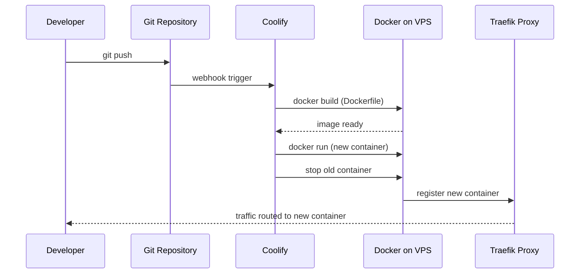

# Deployment Guide — Gestione Immobiliare

> **Current deployment:** Hetzner VPS (Ubuntu) + Coolify control panel  
> **Live URL:** https://immobiliare.testdemo.it  (the bare testdemo.it domain is no longer bound to this app and returns 503)  
> **Status:** ✅ Live and working as of June 2026

---

## Infrastructure overview

```
Internet
   │
   ▼
Hetzner VPS (91.99.137.240)
   │
   ├─ Coolify (control panel, port 8000)
   │    ├─ coolify-proxy (Traefik, ports 80/443)
   │    ├─ App container  (PHP 8.3 + Apache)
   │    └─ DB container   (MySQL 8, named "default")
   │
   └─ Cloudflare DNS (testdemo.it → 91.99.137.240)
```

---

## DNS records (testdemo.it via Cloudflare)

| Type | Name | Value | Purpose |
|------|------|-------|---------|
| A | @ | 91.99.137.240 | Root domain → VPS |
| CNAME | www | testdemo.it | www redirect |
| TXT | @ | v=spf1 include:mailgun.org ~all | Mailgun SPF |
| TXT | smtp._domainkey | (DKIM key from Mailgun) | Mailgun DKIM |
| MX | mail | mxa.mailgun.org (10) | Mailgun inbound |
| MX | mail | mxb.mailgun.org (10) | Mailgun inbound |

> **Note:** Nameservers were changed from GoDaddy to Cloudflare. All DNS management is now via Cloudflare dashboard.

---

## Environment variables (set in Coolify)

```
APP_ENV=production
APP_DEBUG=false
APP_URL=https://immobiliare.testdemo.it
FORCE_HTTPS=true

DB_HOST=k6ctgb6t5pco3p4qabrgl8h3   # Coolify internal DB hostname
DB_PORT=3306
DB_NAME=default                     # ⚠️ Coolify names DB "default"
DB_USER=gestionale_app             # least-privilege user (database/create_app_user.sql) — NOT root
DB_PASS=<strong-password>

SESSION_NAME=gestionale_session    # canonical name (matches code default + all env templates)
CRON_SECRET=<change-me>             # ⚠️ Must change from placeholder

AGENCY_NAME=Anije Immobiliare
AGENCY_EMAIL=noreply@mail.testdemo.it   # Must be on verified Mailgun domain

SMTP_HOST=smtp.eu.mailgun.org       # EU region
SMTP_PORT=587
SMTP_SECURE=tls
SMTP_USER=postmaster@mail.testdemo.it
SMTP_PASS=<mailgun-smtp-pass>

TWILIO_ACCOUNT_SID=<sid>
TWILIO_AUTH_TOKEN=<token>
TWILIO_WHATSAPP_FROM=whatsapp:+14155238886   # Sandbox number

META_APP_ID=<id>
META_APP_SECRET=<secret>
META_PUBLIC_BASE_URL=https://testdemo.it    # Required for Instagram image URLs

SETUP_ENABLED=false
ADMIN_PASSWORD=<change-from-admin>  # ⚠️ Must change
```

---

## Initial database setup

The schema lives in `database/schema_production.sql`. To import into the Coolify MySQL container:

```bash
# 1. Copy schema to server
scp database/schema_production.sql root@91.99.137.240:/root/

# 2. SSH into server
ssh root@91.99.137.240

# 3. Find the app container name
docker ps

# 4. Import schema (replace CONTAINER_NAME with actual name)
docker exec -i CONTAINER_NAME \
  mysql -h k6ctgb6t5pco3p4qabrgl8h3 -u root -p<DB_PASS> default \
  < /root/schema_production.sql
```

---

## Deployment workflow (via Coolify)

1. Push changes to the connected Git branch
2. Coolify auto-deploys (or click **Redeploy** in the dashboard)
3. Zero-downtime: Coolify spins new container before stopping old one
4. Check logs in Coolify → Application → Logs if something breaks



---

## Dockerfile summary

```dockerfile
FROM php:8.3-apache-bookworm

# Extensions: pdo_mysql, mbstring, gd, zip, intl, curl
# Apache: mod_rewrite, mod_headers enabled
# Custom entrypoint handles PORT env var for Coolify compatibility
```

The `docker-entrypoint.sh` script reads `$PORT` and updates Apache's Listen directive before starting Apache. This is required because Coolify assigns a random port for the proxy.

---

## Cron jobs (⚠️ NOT YET CONFIGURED)

These cron jobs need to be set up on the Hetzner server. Run them via `docker exec` or set up a host crontab:

```bash
# On the VPS host, add to crontab (crontab -e):
CONTAINER="<app-container-name>"

# Process reminders and send notifications - every 15 min
*/15 * * * * docker exec $CONTAINER php /var/www/html/cron/process_reminders.php

# Send payment reminders - daily at 8am
0 8 * * * docker exec $CONTAINER php /var/www/html/cron/send_payment_reminders.php

# Publish scheduled social posts - every 5 min
*/5 * * * * docker exec $CONTAINER php /var/www/html/cron/publish_social_posts.php

# Contract expiration checks - daily at 9am
0 9 * * * docker exec $CONTAINER php /var/www/html/cron/process_contract_expirations.php

# Database backup - daily at 2am
0 2 * * * docker exec $CONTAINER php /var/www/html/cron/backup_database.php
```

All cron endpoints require the `X-Cron-Secret: <CRON_SECRET>` header (or pass as query param). Set `CRON_SECRET` to a strong random value in Coolify env vars.

---

## Traefik / HTTPS

Coolify's Traefik proxy (`coolify-proxy` container) handles:
- HTTP → HTTPS redirect
- Let's Encrypt SSL certificate for testdemo.it
- `X-Forwarded-Proto` header (required for `FORCE_HTTPS` logic in `bootstrap.php`)

The app checks `$_SERVER['HTTP_X_FORWARDED_PROTO']` to detect HTTPS when behind Traefik.

---

## Troubleshooting

| Symptom | Cause | Fix |
|---------|-------|-----|
| Site shows default Apache page | DNS not propagated or A record conflict | Check DNS, remove duplicate A records |
| `Uncaught SyntaxError` in JS console | PHP error output in HTML (`APP_DEBUG=true`) | Set `APP_DEBUG=false` |
| DB connection error | `DB_NAME` mismatch | Coolify creates DB named `default`, not `gestione_immobiliare` |
| SMTP auth fails | Wrong TLS method | `config/mail.php` uses `STREAM_CRYPTO_METHOD_TLSv1_2_CLIENT \| STREAM_CRYPTO_METHOD_TLSv1_3_CLIENT` |
| Mailgun "domain unverified" | Missing MX records | Add MX records for `mail.testdemo.it` |
| WhatsApp messages not saved | Wrong webhook URL in Twilio | URL must be `https://testdemo.it/api/whatsapp_webhook.php` |
| Container not found after redeploy | Container renamed on each deploy | Run `docker ps` to get new name |

---

## Local development

```bash
# Using Docker Compose
docker-compose up -d

# App at http://localhost:8080
# MySQL at localhost:3306 (user: root, pass: root, db: gestione_immobiliare)
```

The `docker-compose.yml` at project root defines the local stack. The `.env` file is used locally (not in production — Coolify env vars replace it).
