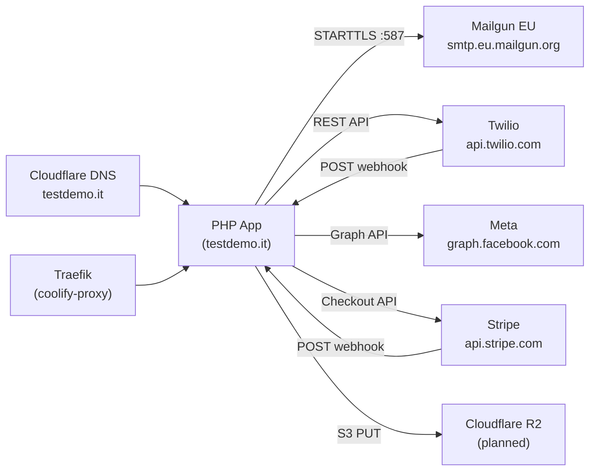

# Integrations — Gestione Immobiliare

Status of all third-party service integrations as of June 2026.

| Integration | Status | Config location |
|-------------|--------|-----------------|
| Mailgun (email) | ✅ Working | Coolify env vars + app_settings |
| Twilio WhatsApp | ✅ Working (sandbox) | Coolify env vars + app_settings |
| Meta Graph API (Facebook) | ✅ Working | social_settings table |
| Meta Graph API (Instagram) | ✅ Working (requires image) | social_settings table |
| Stripe (payments) | ⚠️ Code exists, not configured | Coolify env vars |
| Cloudflare R2 / S3 backup | 🔄 In progress | Planned env vars |
| Cron jobs | ⚠️ Not yet set up on server | See DEPLOY.md |

---

## 1. Mailgun (Email)

**Status:** ✅ Working  
**Provider:** Mailgun EU  
**Code:** `config/mail.php`

### How it works

All outbound email goes through `sendClientEmail()` → `sendViaSmtp()`. The function opens a raw TCP socket, performs STARTTLS, authenticates, and sends RFC 2822-formatted email manually (no PHPMailer dependency).

### Configuration

| Env var | Value | Notes |
|---------|-------|-------|
| `SMTP_HOST` | `smtp.eu.mailgun.org` | **EU region** — not `smtp.mailgun.org` |
| `SMTP_PORT` | `587` | STARTTLS |
| `SMTP_SECURE` | `tls` | Triggers STARTTLS path |
| `SMTP_USER` | `postmaster@mail.testdemo.it` | Mailgun SMTP user |
| `SMTP_PASS` | `(Mailgun SMTP password)` | From Mailgun dashboard |
| `AGENCY_EMAIL` | `noreply@mail.testdemo.it` | **Must be on verified sending domain** |

### DNS records required

| Type | Host | Value |
|------|------|-------|
| TXT | @ | `v=spf1 include:mailgun.org ~all` |
| TXT | smtp._domainkey.mail | DKIM public key from Mailgun |
| MX | mail | mxa.mailgun.org (priority 10) |
| MX | mail | mxb.mailgun.org (priority 10) |

### Critical bug fix applied

The original code used `STREAM_CRYPTO_METHOD_TLS_CLIENT` which is deprecated and fails against modern SMTP servers. Fixed in `config/mail.php` line 90:

```php
// ❌ Old (fails with TLS handshake error)
stream_socket_enable_crypto($socket, true, STREAM_CRYPTO_METHOD_TLS_CLIENT);

// ✅ Fixed
stream_socket_enable_crypto($socket, true, STREAM_CRYPTO_METHOD_TLSv1_2_CLIENT | STREAM_CRYPTO_METHOD_TLSv1_3_CLIENT);
```

### Known gaps

- No retry logic — if SMTP fails, the message is lost (not queued)
- No bounce/delivery webhook handling from Mailgun
- `AGENCY_EMAIL` must be on a Mailgun-verified domain; using a Gmail address as FROM causes rejection

---

## 2. Twilio WhatsApp

**Status:** ✅ Working (Twilio Sandbox)  
**Code:** `config/whatsapp.php`, `api/whatsapp_webhook.php`, `api/whatsapp_inbox.php`

### Architecture

```
Outbound: PHP → Twilio REST API → WhatsApp
Inbound:  WhatsApp → Twilio → POST /api/whatsapp_webhook.php → MySQL
```

### Outbound flow

`sendWhatsAppMessage($to, $body)` in `config/whatsapp.php`:
1. Checks `whatsapp_enabled` setting (if false, simulates success)
2. Calls Twilio REST API: `POST https://api.twilio.com/2010-04-01/Accounts/{SID}/Messages.json`
3. From number: `whatsapp:+14155238886` (sandbox)
4. Saves to `communications` table with `channel = whatsapp`

### Inbound flow

Twilio POSTs to `https://testdemo.it/api/whatsapp_webhook.php` with fields:
- `From` — sender's WhatsApp number (`whatsapp:+39...`)
- `To` — sandbox number
- `Body` — message text
- `MessageSid` — Twilio message ID

The webhook:
1. Calls `parseTwilioWebhook($_POST)` to extract fields
2. Inserts into `whatsapp_messages` (`direction = inbound`)
3. Inserts notification record
4. Returns empty TwiML `<Response/>` to suppress Twilio auto-reply

### Configuration

| Env var | Value |
|---------|-------|
| `TWILIO_ACCOUNT_SID` | From Twilio console |
| `TWILIO_AUTH_TOKEN` | From Twilio console |
| `TWILIO_WHATSAPP_FROM` | `whatsapp:+14155238886` (sandbox) |

### Twilio sandbox setup

Users must join the sandbox by texting `join <sandbox-word>` to `+14155238886` before messages arrive.  
The sandbox webhook URL must be set to: `https://testdemo.it/api/whatsapp_webhook.php`

### Known gaps

- **No Twilio signature validation** — the webhook does not verify the `X-Twilio-Signature` header. Any POST to that URL will be accepted and saved. Fix: validate using Twilio PHP SDK `validateRequest()` or manual HMAC check.
- Still on **sandbox** — production requires a paid Twilio WhatsApp Business number
- No media handling — `media_url` column exists but attachments are not displayed in inbox UI
- The `api/whatsapp_inbox.php` endpoint (NOT the webhook) handles the inbox UI data — these are two different files

---

## 3. Meta Graph API (Facebook + Instagram)

**Status:** ✅ Working  
**Code:** `config/meta.php`, `meta_oauth.php`, `meta_callback.php`

### OAuth flow

```
1. Admin clicks "Connetti Facebook" in Settings
2. meta_oauth.php redirects to Meta with scopes:
   - pages_manage_posts
   - pages_read_engagement
   - instagram_basic
   - instagram_content_publish
3. Meta redirects back to meta_callback.php?code=...
4. callback exchanges code for user_access_token
5. Fetches page list + page_access_tokens
6. Fetches Instagram account linked to the page
7. Stores everything in social_settings table
```

### Publishing flow

`publishSocialPost($post)` in `config/meta.php`:

**Facebook:**
- `POST /{page_id}/feed` with `message` and optionally `link`
- Works with text only

**Instagram:**
- Step 1: `POST /{ig_account_id}/media` with `image_url` (must be a public HTTPS URL) + `caption`
- Step 2: `POST /{ig_account_id}/media_publish` with `creation_id` from step 1
- **Requires:** `image_path` set on the post AND `META_PUBLIC_BASE_URL` env var

### Selecting an image for Instagram posts

In the social posts modal, the user must:
1. Select a property (images appear as thumbnails)
2. **Click a thumbnail** to select it — this sets the `post-property-media-id` hidden input
3. Just viewing thumbnails is NOT enough — a click is required

### Configuration

| Env var | Purpose |
|---------|---------|
| `META_APP_ID` | Meta developer app ID |
| `META_APP_SECRET` | Meta app secret |
| `META_PUBLIC_BASE_URL` | Base URL for serving images to Instagram (must be public HTTPS) |

OAuth tokens are stored in `social_settings` table (not env vars).

### Known gaps

- **Token expiration** — Meta user tokens expire (~60 days). No automatic refresh. Admin must reconnect manually via Settings → Social.
- **Advanced access required for production** — currently uses Development mode (works for own accounts only). For posting to public pages and external audiences, the app needs Meta App Review.
- **Instagram text-only not supported** — Instagram requires an image. Facebook works without one.
- No video post support

---

## 4. Stripe (Online Payments)

**Status:** ⚠️ Code exists, not configured  
**Code:** `api/stripe_checkout.php`, `api/stripe_webhook.php`

### What's implemented

- Checkout session creation (`stripe_checkout.php`)
- Webhook handler for `checkout.session.completed` (`stripe_webhook.php`)
- `stripe_payments` table for tracking Stripe-specific payment data

### What's needed to activate

1. Add Stripe env vars to Coolify:
   ```
   STRIPE_PUBLIC_KEY=pk_live_...
   STRIPE_SECRET_KEY=sk_live_...
   STRIPE_WEBHOOK_SECRET=whsec_...
   ```
2. Register webhook in Stripe dashboard → `https://testdemo.it/api/stripe_webhook.php`
3. Events: `checkout.session.completed`, `payment_intent.payment_failed`

### Known gaps

- No UI for tenants to initiate payment (tenant portal would need a "Pay now" button)
- Stripe webhook secret validation should use `Stripe\Webhook::constructEvent()` (requires Stripe PHP SDK)
- Currently the Stripe PHP SDK may not be installed (`composer.json` should be checked)

---

## 5. Cloudflare R2 / S3 Backup

**Status:** 🔄 In progress  
**Code:** `config/backup_cloud.php`, `cron/backup_database.php`

### Plan

- Cloudflare R2 bucket (S3-compatible) for database dump backups
- Nameservers already migrated to Cloudflare ✅
- R2 bucket not yet created

### What's needed

1. Create R2 bucket in Cloudflare dashboard
2. Generate R2 API credentials (Access Key ID + Secret)
3. Add to Coolify env vars:
   ```
   BACKUP_S3_ENDPOINT=https://<account_id>.r2.cloudflarestorage.com
   BACKUP_S3_BUCKET=gestione-immobiliare-backups
   BACKUP_S3_KEY=<r2-access-key-id>
   BACKUP_S3_SECRET=<r2-secret-key>
   BACKUP_S3_REGION=auto
   ```
4. Set up `cron/backup_database.php` cron job (see DEPLOY.md)

---

## 6. Cron jobs

**Status:** ⚠️ Not configured on production server  
**Code:** `cron/` directory

All cron scripts use `config/cron_bootstrap.php` (no web session auth). They can be triggered:
- Via CLI: `php cron/process_reminders.php`
- Via HTTP with secret: `GET /api/process_reminders.php?secret=<CRON_SECRET>`

See DEPLOY.md for the full crontab setup instructions.

---

## Integration dependency map


