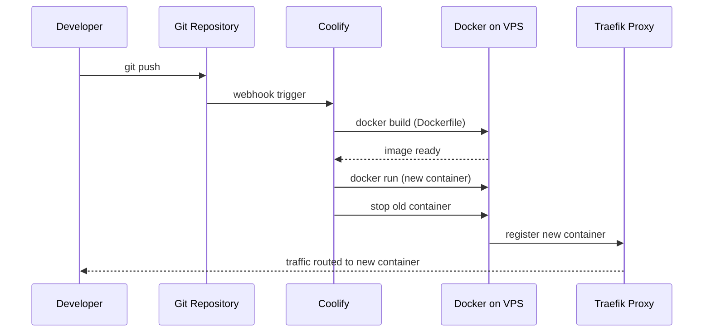

# Deployment Guide — Gestione Immobiliare

> **Current deployment:** Hetzner VPS (Ubuntu) + Coolify control panel  
> **Live URL:** https://immobiliare.testdemo.it  (the bare testdemo.it domain is no longer bound to this app and returns 503)  
> **Status:** ✅ Live and working as of June 2026

---

## Infrastructure overview

```
Internet
   │
   ▼
Hetzner VPS (91.99.137.240)
   │
   ├─ Coolify (control panel, port 8000)
   │    ├─ coolify-proxy (Traefik, ports 80/443)
   │    ├─ App container  (PHP 8.4 + Apache)
   │    └─ DB container   (MySQL 8, named "default")
   │
   └─ Cloudflare DNS (testdemo.it → 91.99.137.240)
```

---

## DNS records (testdemo.it via Cloudflare)

| Type | Name | Value | Purpose |
|------|------|-------|---------|
| A | @ | 91.99.137.240 | Root domain → VPS |
| CNAME | www | testdemo.it | www redirect |
| TXT | @ | v=spf1 include:mailgun.org ~all | Mailgun SPF |
| TXT | smtp._domainkey | (DKIM key from Mailgun) | Mailgun DKIM |
| MX | mail | mxa.mailgun.org (10) | Mailgun inbound |
| MX | mail | mxb.mailgun.org (10) | Mailgun inbound |

> **Note:** Nameservers were changed from GoDaddy to Cloudflare. All DNS management is now via Cloudflare dashboard.

---

## Environment variables (set in Coolify)

```
APP_ENV=production
APP_DEBUG=false
APP_URL=https://immobiliare.testdemo.it
FORCE_HTTPS=true

DB_HOST=k6ctgb6t5pco3p4qabrgl8h3   # Coolify internal DB hostname
DB_PORT=3306
DB_NAME=default                     # ⚠️ Coolify names DB "default"
DB_USER=gestionale_app             # least-privilege user (database/create_app_user.sql) — NOT root
DB_PASS=<strong-password>

SESSION_NAME=gestionale_session    # canonical name (matches code default + all env templates)
CRON_SECRET=<change-me>             # ⚠️ Must change from placeholder

AGENCY_NAME=Anije Immobiliare
AGENCY_EMAIL=<indirizzo del mittente>   # deve essere un mittente autorizzato dal provider SMTP

# ⚠️ In produzione (verificato 02/08/2026) la posta esce da smtp.gmail.com, non
# da Mailgun: Mailgun blocca a livello di account. Le righe SMTP qui sotto sono
# quindi un ESEMPIO. Contano solo se in `app_settings` non c'e' gia' la chiave
# corrispondente — e c'e': la pagina Impostazioni vince sull'ambiente.
SMTP_HOST=smtp.gmail.com
SMTP_PORT=587
SMTP_SECURE=tls
SMTP_USER=<account@gmail.com>
SMTP_PASS=<app password, non la password dell'account>

# Posta in ENTRATA (route Mailgun -> api/email_inbound.php). Senza questa chiave
# la produzione rifiuta ogni richiesta non firmata: l'acquisizione dei lead dai
# portali tace senza errori visibili.
MAILGUN_WEBHOOK_KEY=<signing key>

WHATSAPP_ENABLED=false                       # true per spedire davvero, non simulare
META_WA_PHONE_NUMBER_ID=<id del mittente, solo cifre>
META_WA_ACCESS_TOKEN=<token permanente da System User, non quello di sviluppo>
META_WA_APP_SECRET=<app secret>              # firma i webhook in arrivo
META_WA_VERIFY_TOKEN=<stringa scelta da te>  # da ripetere nel pannello Meta
WHATSAPP_FROM=+393331234567                  # numero mostrato come mittente

META_APP_ID=<id>
META_APP_SECRET=<secret>
# META_PUBLIC_BASE_URL non serve: la base pubblica per le immagini Instagram
# deriva da APP_URL. Va impostata SOLO in sviluppo locale, dove APP_URL e'
# localhost e serve un tunnel (ngrok). Puntata a un host che non serve i file —
# per esempio il dominio nudo invece del sottodominio — Meta riceve un 404 e
# ogni post con immagine fallisce.

SETUP_ENABLED=false
ADMIN_PASSWORD=<change-from-admin>  # ⚠️ Must change
```

---

## Initial database setup

The schema lives in `database/schema_production.sql`. To import into the Coolify MySQL container:

```bash
# 1. Copy schema to server
scp database/schema_production.sql root@91.99.137.240:/root/

# 2. SSH into server
ssh root@91.99.137.240

# 3. Find the app container name
docker ps

# 4. Import schema (replace CONTAINER_NAME with actual name)
docker exec -i CONTAINER_NAME \
  mysql -h k6ctgb6t5pco3p4qabrgl8h3 -u root -p<DB_PASS> default \
  < /root/schema_production.sql
```

### Create the least-privilege app user (do NOT run the app as root)

The `DB_USER=gestionale_app` referenced above must exist and own only the app
schema. Create it once, as an admin MySQL user:

```bash
# 1. Copy the user script to the server
scp database/create_app_user.sql root@91.99.137.240:/root/

# 2. Edit it and set a strong password (generate one: openssl rand -base64 24)
#    then run it as an admin user. It grants ALL on `default` (prod) +
#    `gestione_immobiliare` (dev) and NOTHING global — no SUPER/FILE/other DBs.
docker exec -i CONTAINER_NAME \
  mysql -h k6ctgb6t5pco3p4qabrgl8h3 -u root -p<ADMIN_DB_PASS> \
  < /root/create_app_user.sql

# 3. Set DB_USER=gestionale_app + DB_PASS=<that password> in Coolify env, redeploy.

# 4. Verify the app user is scoped (must show only DB-scoped grants, no *.*):
docker exec -i CONTAINER_NAME \
  mysql -h k6ctgb6t5pco3p4qabrgl8h3 -u root -p<ADMIN_DB_PASS> \
  -e "SHOW GRANTS FOR 'gestionale_app'@'%';"
```

> Migrations run on every container start (`database/migrate.php`) using this
> same user, so it intentionally has DDL (CREATE/ALTER/INDEX) — but only on the
> app schema. That is the least privilege that keeps migrations working.
>
> **After switching the user, do one deploy and read the Coolify logs** to
> confirm `[entrypoint] applying database migrations...` completes cleanly. The
> migration helper procedures in `schema_production.sql` are declared
> `DEFINER=root@localhost`; if a future migration `CALL`s them and the log shows
> a *"definer does not exist"* error, re-import those two `CREATE PROCEDURE`
> blocks without the explicit `DEFINER` clause (they'll then bind to the app
> user). Existing prod is unaffected — its pending-migration set is already empty.

---

## Deployment workflow (via Coolify)

1. Push changes to the connected Git branch
2. Coolify auto-deploys (or click **Redeploy** in the dashboard)
3. Zero-downtime: Coolify spins new container before stopping old one
4. Check logs in Coolify → Application → Logs if something breaks



---

## Dockerfile summary

```dockerfile
FROM php:8.4-apache-bookworm

# Extensions: pdo, pdo_mysql, zip, intl, mbstring, gd, exif, apcu (PECL)
# Apache: mod_rewrite, mod_headers, mod_deflate enabled
# Custom entrypoint handles PORT env var for Coolify compatibility
```

This block used to say `php:8.3` and list `gd` among the extensions. Neither was
true: the base image is 8.4, and `gd` was never in the `docker-php-ext-install`
line — the property photo pipeline that needs it was added later. Both now match
the Dockerfile. If you change extensions, change them here too, or the next
person debugging a missing function will trust this list and lose an hour.

`gd` must be **configured before installing** (`docker-php-ext-configure gd
--with-jpeg --with-webp`): without those flags it compiles PNG-only and every
JPEG silently skips resizing. `exif` is what keeps portrait phone photos from
coming out sideways.

The `docker-entrypoint.sh` script reads `$PORT` and updates Apache's Listen directive before starting Apache. This is required because Coolify assigns a random port for the proxy.

---

## One-off after deploying the image pipeline (phase82)

New uploads are resized and get a thumbnail automatically. Photos already in the
archive keep their original size until backfilled — the migration adds the column
but deliberately does not generate files (a long resize loop inside the container
entrypoint would risk a deploy timeout).

Same container-name rule as the cron jobs below — filter on the app UUID prefix
and `| head -n1`, never a literal name.

```bash
APP=bs555w5mvdeffngi7vxab4qo
docker exec $(docker ps -qf name=$APP | head -n1) php /var/www/html/scripts/backfill_media_thumbnails.php --dry-run
```

The dry run writes nothing and reports what it would touch. Then run it for real
— idempotent, resumable, batchable with `--limit=N`, and `--thumbs-only` leaves
the originals untouched:

```bash
docker exec $(docker ps -qf name=$APP | head -n1) php /var/www/html/scripts/backfill_media_thumbnails.php
```

---

## Cron jobs (installed on the Hetzner host — 2026-07-28)

**Do not hardcode the container name.** Coolify appends a fresh timestamp suffix on
every deploy (`<appUuid>-053929452837`), so a literal name goes stale at the next
push and the job silently stops. Filter on the **application UUID prefix**, which is
stable, and always `| head -n1`:

```bash
docker ps -qf name=bs555w5mvdeffngi7vxab4qo | head -n1
```

> A previous crontab used `docker ps -qf "name=gestione"`, which matches nothing —
> the command collapsed to `docker exec php …` and every job failed nightly with
> `No such container: php` for months. The scripts also live in `cron/`, not
> `config/`. Both mistakes were invisible because nothing checks a cron's *output*.
> After any change, verify with the heartbeat (below), never by reading the crontab.

```bash
# On the VPS host (crontab -e). APP=Coolify application UUID prefix.
APP=bs555w5mvdeffngi7vxab4qo

# Process reminders and send notifications - hourly
0 * * * * docker exec $(docker ps -qf name=$APP | head -n1) php /var/www/html/cron/process_reminders.php >> /var/log/gestione-cron.log 2>&1

# Send payment reminders - daily at 8am
0 8 * * * docker exec $(docker ps -qf name=$APP | head -n1) php /var/www/html/cron/send_payment_reminders.php >> /var/log/gestione-cron.log 2>&1

# Publish scheduled social posts - every 15 min
*/15 * * * * docker exec $(docker ps -qf name=$APP | head -n1) php /var/www/html/cron/publish_social_posts.php >> /var/log/gestione-cron.log 2>&1

# Overdue key returns - daily at 8:30am
30 8 * * * docker exec $(docker ps -qf name=$APP | head -n1) php /var/www/html/cron/process_key_returns.php >> /var/log/gestione-cron.log 2>&1

# Database backup - daily at 2am
0 2 * * * docker exec $(docker ps -qf name=$APP | head -n1) php /var/www/html/cron/backup_database.php >> /var/log/gestione-cron.log 2>&1

# Contract expirations + draft check-out reports - daily at 9am
0 9 * * * docker exec $(docker ps -qf name=$APP | head -n1) php /var/www/html/cron/process_contract_expirations.php >> /var/log/gestione-cron.log 2>&1

# GDPR retention purge - weekly, Sunday 03:30
30 3 * * 0 docker exec $(docker ps -qf name=$APP | head -n1) php /var/www/html/cron/gdpr_retention.php >> /var/log/gestione-cron.log 2>&1
```

All seven jobs are scheduled and have produced a heartbeat. `gdpr_retention` is the only
one that deletes: it purges `data_processing_log`, `communications`, `whatsapp_messages`,
`activity_log`, `login_attempts` and `api_rate_limits` past their `retention_*` window in
`app_settings` (`0` = keep forever). Documents are **reported, never auto-deleted** —
fiscal law requires ~10 years and the deletion is irreversible. Count the damage before
changing a retention setting:

```sql
SELECT COUNT(*) FROM communications WHERE created_at < DATE_SUB(NOW(), INTERVAL 36 MONTH);
```

`CRON_SECRET` gates only the **HTTP** entry points: every `cron/*.php` skips the
check under `PHP_SAPI === 'cli'`. Do not pass the secret as a command-line argument
— it is ignored there and shows up in `ps` for any user on the box.

### Verifying a cron actually runs

Script on disk ≠ job executing. Each job writes `cron_last_<job>` into
`app_settings` on success, and `api/readiness.php` flags stale ones:

```bash
docker exec $(docker ps -qf name=$APP | head -n1) php -r 'require "/var/www/html/config/env.php"; loadEnv("/var/www/html/.env"); require "/var/www/html/config/db.php"; $s=getDB()->prepare("SELECT setting_key k, setting_value v FROM app_settings WHERE setting_key LIKE ? ORDER BY setting_key"); $s->execute(["cron_last_%"]); foreach($s->fetchAll() as $r) echo str_pad($r["k"],30).$r["v"].PHP_EOL;'
```

---

## Traefik / HTTPS

Coolify's Traefik proxy (`coolify-proxy` container) handles:
- HTTP → HTTPS redirect
- Let's Encrypt SSL certificate for testdemo.it
- `X-Forwarded-Proto` header (required for `FORCE_HTTPS` logic in `bootstrap.php`)

The app checks `$_SERVER['HTTP_X_FORWARDED_PROTO']` to detect HTTPS when behind Traefik.

---

## Troubleshooting

| Symptom | Cause | Fix |
|---------|-------|-----|
| Site shows default Apache page | DNS not propagated or A record conflict | Check DNS, remove duplicate A records |
| `Uncaught SyntaxError` in JS console | PHP error output in HTML (`APP_DEBUG=true`) | Set `APP_DEBUG=false` |
| DB connection error | `DB_NAME` mismatch | Coolify creates DB named `default`, not `gestione_immobiliare` |
| SMTP auth fails | Wrong TLS method | `config/mail.php` uses `STREAM_CRYPTO_METHOD_TLSv1_2_CLIENT \| STREAM_CRYPTO_METHOD_TLSv1_3_CLIENT` |
| Mailgun "domain unverified" | Missing MX records | Add MX records for `mail.testdemo.it` |
| WhatsApp messages not saved | URL del webhook errata nel pannello Meta | Deve essere `https://immobiliare.testdemo.it/api/whatsapp_webhook.php`, con il campo `messages` sottoscritto |
| WhatsApp: il webhook risponde `503` | Manca `META_WA_APP_SECRET`: in produzione la firma non e' verificabile e si rifiuta tutto | Impostare l'app secret (ambiente o Impostazioni) |
| Una env var "non fa effetto" | Esiste gia' la riga in `app_settings`, che vince sull'ambiente | Cambiare il valore da Impostazioni, non da Coolify |
| Post Instagram falliscono con 404 sull'immagine | `META_PUBLIC_BASE_URL` punta a un host che non serve i file | Rimuoverla: la base deriva da `APP_URL` |
| Container not found after redeploy | Container renamed on each deploy | Run `docker ps` to get new name |

---

## Local development

```bash
# Using Docker Compose
docker-compose up -d

# App at http://localhost:8080
# MySQL at localhost:3306 (user: root, pass: root, db: gestione_immobiliare)
```

The `docker-compose.yml` at project root defines the local stack. The `.env` file is used locally (not in production — Coolify env vars replace it).
