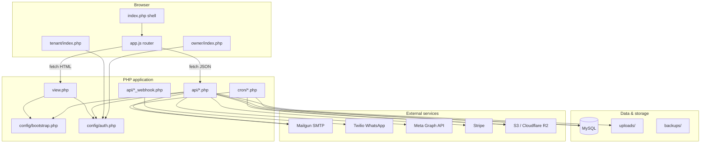
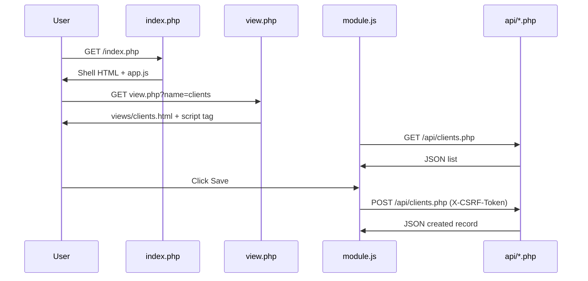
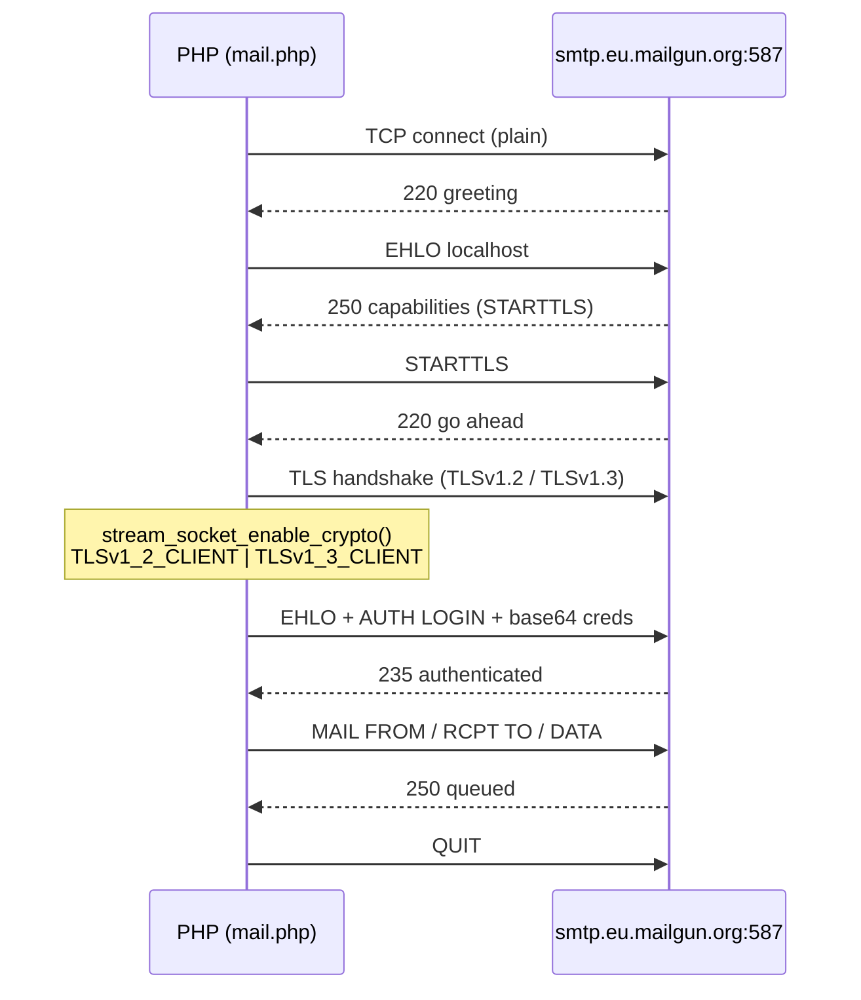
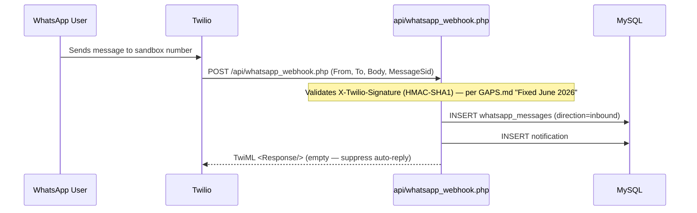
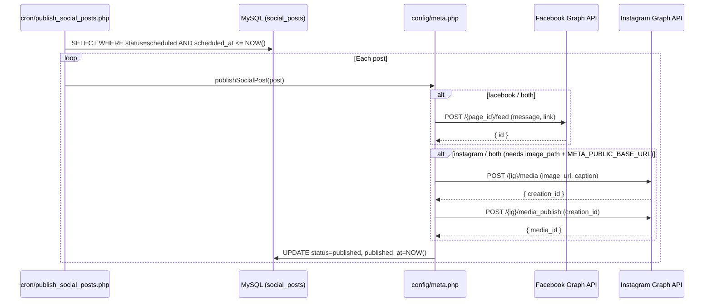
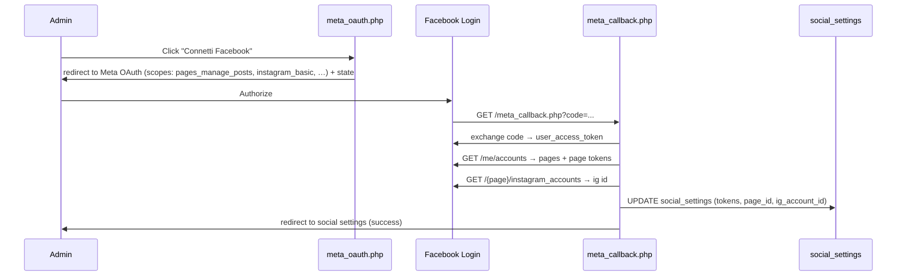

# 02 — Architecture

> Consolidated from docs/ARCHITECTURE.md. The admin app is a single-page shell
> (`index.php`) that never full-page-reloads when switching modules. Each module is an
> HTML partial + a dedicated JS file that talks to JSON APIs.

---

## High-level architecture



---

## Directory layout (application)

```
├── index.php              # Admin shell (sidebar, topbar, #app-content)
├── login.php / logout.php # Admin authentication
├── setup.php              # One-time first-admin creation
├── view.php               # Auth-gated HTML partial loader (allowlist + role check)
├── branding.css.php       # Dynamic CSS variables from DB settings
├── meta_oauth.php         # Meta OAuth redirect start
├── meta_callback.php      # Meta OAuth callback handler
│
├── api/                   # JSON REST-style endpoints (one file per resource)
├── assets/
│   ├── css/style.css      # Global styles + responsive layout
│   └── js/
│       ├── app.js         # Router, fetch wrapper, sidebar
│       └── *.js           # Per-module logic (clients.js, properties.js, …)
├── config/                # Bootstrap, DB, auth, roles, integrations (service layer)
├── cron/                  # CLI cron scripts (blocked from web via .htaccess)
├── database/
│   ├── schema.sql         # Dev schema with seed data
│   ├── schema_production.sql
│   └── migrations/        # Incremental upgrades (phase3 → phase28)
├── lib/                   # SimplePdf and other shared libraries
├── owner/                 # Owner portal (auth.php, login, index, report, logout)
├── tenant/                # Tenant portal (login + dashboard)
├── uploads/               # User-uploaded files (logos, documents, media)
└── views/                 # HTML partials (not served directly)
```

`.htaccess` protection: root rules block `config/`, `database/`, `cron/`, `backups/`,
`.env`. `views/.htaccess` denies direct access (only reachable via `view.php`).
`uploads/.htaccess` blocks PHP execution.

---

## Request flow — admin dashboard

### 1. Initial page load
1. Browser requests `index.php`.
2. `config/bootstrap.php` loads `.env`, configures errors, optional HTTPS redirect, starts the admin session, initialises the CSRF token.
3. `requireAuthWeb()` redirects unauthenticated users to `login.php`.
4. PHP renders the fixed layout: sidebar navigation, topbar, empty `#app-content`.
5. `assets/js/app.js` runs on `DOMContentLoaded` and calls `loadView('view.php?name=dashboard', 'dashboard')`.

### 2. View navigation (AJAX)
1. User clicks a sidebar link (e.g. *Proprietari*).
2. `app.js` intercepts the click and `fetch`es `view.php?name=clients`.
3. `view.php` checks session auth, validates the view name against an allowlist (`$allowed`), and checks `canAccessView()` for role-based access.
4. On success, raw HTML from `views/clients.html` is injected into `#app-content`.
5. `app.js` re-executes any `<script>` tags in the partial (e.g. `clients.js`), which binds UI events and loads data from APIs.

### 3. API calls
1. Module JS calls `fetch('/api/clients.php')` (or POST/PUT/DELETE with JSON body).
2. `config/api_bootstrap.php` loads bootstrap + DB, calls `requireAuthApi()` (401 if no session).
3. For POST/PUT/PATCH/DELETE, `api_bootstrap.php` (lines 22–25) calls `validateCsrfToken()`, then `requireWriteAccess()` blocks `readonly` users.
4. Endpoint handles the request, returns JSON via `apiSuccess()` / `apiError()`.
5. The global `fetch` wrapper in `app.js` redirects to `login.php` on any 401.



---

## API design conventions

There is **no central router** — Apache maps the URL path to the file directly. Each file
under `api/` is a self-contained endpoint.

- **Response shape:** `{ "success": true, "data": … }` or `{ "success": false, "error": "…" }`
- **Methods:** REST-like — GET list/detail, POST create, PUT update, DELETE soft-archive
- **Bootstrap:** `require_once '../config/api_bootstrap.php'` (auth + CSRF + write guard)
- **Helpers:** `config/api_helpers.php` — `apiSuccess`, `apiError`, `apiGetJsonBody`, CORS headers limited to `APP_URL`
- **Pagination:** `config/api_pagination.php`

See [06-API-REFERENCE.md](06-API-REFERENCE.md) for the full endpoint catalogue.

---

## Frontend module pattern

Each admin module follows the same shape:
1. **`views/<module>.html`** — markup, modals, table skeleton, toolbar; ends with `<script src="assets/js/<module>.js">`.
2. **`assets/js/<module>.js`** — calls `init()` immediately at load (not on `DOMContentLoaded`, because the partial is injected after the initial page load).
3. Module JS fetches from `api/<module>.php`, renders rows, handles forms/modals, shows alerts.

`app.js` exposes `window.App.navigateTo(viewKey, params)` so modules can cross-link
(e.g. open a client's properties).

### Responsive behaviour
- Sidebar collapses to a hamburger menu on small screens with a backdrop overlay.
- Data tables use `data-label` attributes on `<td>` elements; CSS switches to a card layout on mobile.
- A PWA layer exists (`manifest.json`, `sw.js`).

### Branding
`branding.css.php` reads `primary_color` and `sidebar_color` from `app_settings` and emits
CSS custom properties. Agency name, tagline, and logo path are rendered server-side in
`index.php` from `getPublicBranding()`.

---

## Config service layer

The `config/` folder is the application's service layer. Each file is a collection of plain
PHP functions (no classes). Logical grouping:

```mermaid
classDiagram
    class bootstrap { +initSession() +initCsrfToken() +FORCE_HTTPS redirect }
    class db { +getPdo() PDO +dbQuery(sql, params) PDOStatement }
    class auth {
        +requireAuthWeb() +requireAuthApi() +requireWriteAccess()
        +requireRole(role) +canAccessView(view) bool +getCurrentUser() array
    }
    class roles { +ROLE_PERMISSIONS array +userHasPermission(role, perm) bool }
    class settings { +getSetting(key) +setSetting(key,value) +getMailConfig() +getPublicBranding() }
    class mail { +sendClientEmail() +sendAdminEmail() +sendViaSmtp() +sendTestEmail() }
    class whatsapp { +sendWhatsAppMessage() +parseTwilioWebhook() }
    class meta { +publishSocialPost() +publishToFacebookPage() +publishToInstagram() +isMetaConfigured() }
    class pdf { +generatePdf(template,data) string }
    class backup_cloud { +uploadToS3(filePath) bool }
    class geocode { +geocodeAddress(address) array }
    bootstrap --> db
    bootstrap --> settings
    auth --> db
    auth --> roles
    mail --> settings
    whatsapp --> settings
    meta --> settings
    meta --> db
```



Full `config/` file inventory (24 files): `activity_log.php`, `api_bootstrap.php`,
`api_helpers.php`, `api_pagination.php`, `auth.php`, `backup_cloud.php`, `bootstrap.php`,
`contract_expirations.php`, `cron_bootstrap.php`, `csrf.php`, `db.php`, `env.php`,
`geocode.php`, `login_throttle.php`, `mail.php`, `mail_html.php`, `meta.php`, `pdf.php`,
`rate_limit.php`, `reminders.php`, `roles.php`, `settings.php`, `totp.php`, `whatsapp.php`.

---

## Background jobs

Cron scripts use `config/cron_bootstrap.php` (env + DB, no web session). Logic lives in
`config/reminders.php`, `config/meta.php`, `config/contract_expirations.php`,
`config/backup_cloud.php`.

| Script (`cron/`) | Suggested schedule | Action |
|--------|----------|--------|
| `process_reminders.php` | Every 15 min – hourly | Send due reminder emails; update `last_notified_at`; trigger contract-expiry checks |
| `process_contract_expirations.php` | Daily | Create expiry reminder rows for contracts ending within 30 days |
| `send_payment_reminders.php` | Daily 8am | Send WhatsApp/email reminders for overdue payments |
| `publish_social_posts.php` | Every 5–15 min | Publish scheduled Facebook/Instagram posts |
| `backup_database.php` | Daily 2am | `mysqldump` to `backups/`, optional S3 upload |

Every job also has an HTTP trigger under `api/` protected by `CRON_SECRET`
(header `X-Cron-Secret` or `?secret=`). See [09-DEPLOYMENT-OPERATIONS.md](09-DEPLOYMENT-OPERATIONS.md).

---

## Integration sequence diagrams

### Email — Mailgun STARTTLS


### WhatsApp inbound — Twilio webhook


### Meta social publishing


### Meta OAuth flow


---

## Adding a new module

1. Create `views/myfeature.html` with markup and `<script src="assets/js/myfeature.js">`.
2. Create `assets/js/myfeature.js` with an `init()` function called at file end.
3. Create `api/myfeature.php` using `api_bootstrap.php` and standard JSON helpers.
4. Add the view name to `$allowed` in `view.php`.
5. Add a nav link in `index.php` and a title in `app.js` `viewTitles`.
6. Add a permission in `config/roles.php` `ROLE_PERMISSIONS` if role-gated.
7. Add migration/SQL for any new tables.

This keeps new features consistent without introducing frameworks or build steps.
