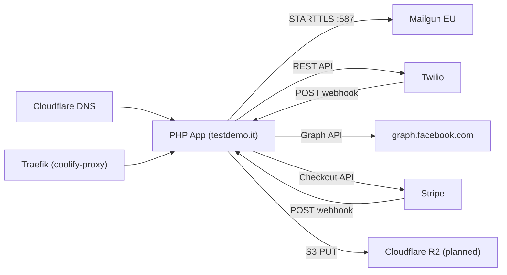

# 08 — Integrations

> Consolidated from docs/INTEGRATIONS.md + docs/WHATSAPP_MIGRATION_PLAN.md. Status as of
> June 2026. Report reality, not status badges (CLAUDE.md §6): state whether each is
> **client-usable** or **demo-only**.

| Integration | Status | Config location |
|-------------|--------|-----------------|
| Mailgun (email) | ✅ Working | Coolify env + `app_settings` |
| Twilio WhatsApp | ⚠️ Working **sandbox** (demo-only) | Coolify env + `app_settings` |
| Meta Graph API (Facebook) | ⚠️ Working, **Development mode** | `social_settings` table |
| Meta Graph API (Instagram) | ⚠️ Working (requires image), Dev mode | `social_settings` table |
| Stripe (payments) | ⚠️ Code exists, not configured | Coolify env |
| Cloudflare R2 / S3 backup | 🔄 In progress | Planned env |
| Cron jobs | ✅ Configured on VPS (verify log) | See [09](09-DEPLOYMENT-OPERATIONS.md) |

---

## 1. Mailgun (Email) — ✅ Working · `config/mail.php`

Outbound goes `sendClientEmail()` → `sendViaSmtp()`: opens a raw TCP socket, STARTTLS,
authenticates, sends RFC 2822 email manually (no PHPMailer dependency).

**Config (env):** `SMTP_HOST=smtp.eu.mailgun.org` (**EU region**), `SMTP_PORT=587`,
`SMTP_SECURE=tls`, `SMTP_USER=postmaster@mail.testdemo.it`, `SMTP_PASS`,
`AGENCY_EMAIL=noreply@mail.testdemo.it` (**must be on a Mailgun-verified domain**).

**DNS required:** SPF TXT `v=spf1 include:mailgun.org ~all`; DKIM TXT at
`smtp._domainkey.mail`; MX `mxa.mailgun.org` + `mxb.mailgun.org` (priority 10).

**Critical fix applied** (`config/mail.php` ~line 90): replaced deprecated
`STREAM_CRYPTO_METHOD_TLS_CLIENT` (fails against modern SMTP) with
`STREAM_CRYPTO_METHOD_TLSv1_2_CLIENT | STREAM_CRYPTO_METHOD_TLSv1_3_CLIENT`.

**Known gaps:** no retry/queue (a failed send is lost); no bounce/delivery webhook; FROM must
be on a verified domain (a Gmail FROM is rejected). Inbound email is handled by
`api/email_inbound.php` (Mailgun HMAC-SHA256 validated → matched to client → `communications`).

---

## 2. Twilio WhatsApp — ⚠️ Sandbox · `config/whatsapp.php`, `api/whatsapp_webhook.php`, `api/whatsapp_inbox.php`

```
Outbound: PHP → Twilio REST API → WhatsApp
Inbound:  WhatsApp → Twilio → POST /api/whatsapp_webhook.php → MySQL
```

**Outbound** `sendWhatsAppMessage($to, $body)`: checks `whatsapp_enabled` (simulates success if
false) → `POST https://api.twilio.com/2010-04-01/Accounts/{SID}/Messages.json` from
`whatsapp:+14155238886` (sandbox) → saves to `communications` (`channel=whatsapp`).

**Inbound** webhook: `parseTwilioWebhook($_POST)` (`From`, `To`, `Body`, `MessageSid`) →
insert `whatsapp_messages` (`direction=inbound`) → insert notification → return empty TwiML
`<Response/>`. Validates `X-Twilio-Signature` (HMAC-SHA1) per GAPS "Fixed June 2026".

**Config:** `TWILIO_ACCOUNT_SID`, `TWILIO_AUTH_TOKEN`, `TWILIO_WHATSAPP_FROM=whatsapp:+14155238886`.
Sandbox setup: users must text `join <word>` to `+14155238886` first; webhook URL =
`https://testdemo.it/api/whatsapp_webhook.php`.

**Known gaps / reality:** still **sandbox** — **not client-usable**; needs a paid WhatsApp
Business number (flag as needing activation). No media rendering in the inbox UI. The inbox UI
data comes from `whatsapp_inbox.php` (a different file from the webhook). Inbox pagination
added (per GAPS). → See the **Meta Cloud migration plan** below.

---

## 3. Meta Graph API (Facebook + Instagram) — ⚠️ Dev mode · `config/meta.php`, `meta_oauth.php`, `meta_callback.php`

**OAuth flow:** Admin clicks "Connetti Facebook" → `meta_oauth.php` redirects to Meta with
scopes `pages_manage_posts`, `pages_read_engagement`, `instagram_basic`,
`instagram_content_publish` → callback exchanges `code` for a user token → fetches page list +
page tokens → fetches linked Instagram account → stores in `social_settings`.

**Publishing** `publishSocialPost($post)`:
- **Facebook:** `POST /{page_id}/feed` with `message` (+ optional `link`). Works text-only.
- **Instagram:** two-step — `POST /{ig}/media` (`image_url` public HTTPS + `caption`) → `POST /{ig}/media_publish` (`creation_id`). **Requires** `image_path` on the post + `META_PUBLIC_BASE_URL`.

**Selecting an IG image:** in the modal, select a property → **click a thumbnail** (sets the
`post-property-media-id` hidden input). Just viewing thumbnails is not enough.

**Config:** `META_APP_ID`, `META_APP_SECRET`, `META_PUBLIC_BASE_URL` (public HTTPS, for IG
images). OAuth tokens live in `social_settings`, not env.

**Known gaps:** tokens expire (~60 days) — no auto-refresh, admin reconnects manually (a token-
expiry email alert was added, error code 190, rate-limited 1/24h). **Development mode** — works
for own accounts only; posting to the agency's public pages needs **Meta App Review**. Instagram
requires an image (no text-only); no video support.

---

## 4. Stripe (Online Payments) — ⚠️ Code exists, not configured · `api/stripe_checkout.php`, `api/stripe_webhook.php`

**Implemented:** Checkout session creation; webhook for `checkout.session.completed`;
`stripe_payments` tracking table. Signature validation via
`\Stripe\Webhook::constructEvent()` (manual HMAC-SHA256 fallback).

**To activate:** add `STRIPE_PUBLIC_KEY`, `STRIPE_SECRET_KEY`, `STRIPE_WEBHOOK_SECRET` to
Coolify; register webhook `https://testdemo.it/api/stripe_webhook.php` for events
`checkout.session.completed`, `payment_intent.payment_failed`. Stripe PHP SDK
(`stripe/stripe-php ^13.0`) is now declared in `composer.json`.

**Known gaps:** no tenant-facing "Pay now" UI. If Stripe stays out of scope, ensure no dead
payment button appears in any portal.

---

## 5. Cloudflare R2 / S3 Backup — 🔄 In progress · `config/backup_cloud.php`, `cron/backup_database.php`

Plan: R2 bucket (S3-compatible) for DB dumps. Nameservers already on Cloudflare; bucket not
yet created. Needs: create bucket, generate API creds, add
`BACKUP_S3_ENDPOINT/BUCKET/KEY/SECRET/REGION=auto` to Coolify, wire the cron.

---

## 6. Cron jobs

Scripts use `config/cron_bootstrap.php` (no web session). Trigger via CLI
(`php cron/process_reminders.php`) or HTTP + secret
(`GET /api/process_reminders.php?secret=<CRON_SECRET>`). Full crontab in
[09-DEPLOYMENT-OPERATIONS.md](09-DEPLOYMENT-OPERATIONS.md). **Verify jobs actually run** by
checking `/var/log/gestione-cron.log` — script existence ≠ scheduled execution.

---

## Integration dependency map



---

# WhatsApp Migration Plan — Twilio → Meta Cloud API

> From docs/WHATSAPP_MIGRATION_PLAN.md. **Plan only** — nothing is "done" until built and
> verified with pasted evidence (CLAUDE.md). Goal: remove the Twilio sandbox dependency and
> build a professional, client-usable WhatsApp integration directly on **Meta WhatsApp Cloud
> API**, with the compliance/reliability layer a real agency needs.

## The decision
Switch transport from **Twilio WhatsApp** to **Meta WhatsApp Cloud API (direct)**. Why: Twilio
is a reseller layer with per-message markup that abstracts away Meta's real template / 24-hour-
window model; the sandbox `join <word>` flow is not demoable. Trade-off: Meta Business
verification is slower and is the **client's** paperwork — the critical path.

## Keep vs replace

**Keep (reuse/lightly adapt):** `views/whatsapp_inbox.html` + `assets/js/whatsapp_inbox.js`;
`api/whatsapp_inbox.php`; `whatsapp_messages` table shape (extend); rate limiting +
notification-on-inbound + `requireRole` guards; `whatsapp_templates` + CRUD (repurpose to
mirror Meta-approved templates).

**Replace (Twilio-specific):**
| File / symbol | Action |
|---|---|
| `sendWhatsAppMessage()` (Twilio REST) | Replace with Meta Cloud client (`config/whatsapp_cloud.php`) |
| `parseTwilioWebhook()` | Replace with `parseMetaWebhook()` |
| `X-Twilio-Signature` HMAC-SHA1 block | Replace with Meta `hub.challenge` GET handshake + `X-Hub-Signature-256` |
| `getWhatsAppConfig()` Twilio keys | Replace with Meta config keys |
| `.env` `TWILIO_*` | Remove, add `WHATSAPP_*` |
| `twilio_sid` column | Rename to `wa_message_id` (Meta `wamid.*`), keep for idempotency |
| `tests/Unit/WhatsAppTest.php` | Rewrite for `parseMetaWebhook` |

> `config/meta.php` already has a reusable `metaApiRequest()` curl helper + `META_API_VERSION`
> — copy the pattern but keep WhatsApp in a separate `config/whatsapp_cloud.php`.

## Prerequisites (client tasks, critical path)
Meta Business Manager → **Business verification** (legal docs; days-to-weeks) → a dedicated
phone number **not on any WhatsApp app** → WhatsApp Business Account (WABA) → display name
approval → Meta App with WhatsApp product → **permanent System User token**. Deliverables:
`WHATSAPP_PHONE_NUMBER_ID`, `WHATSAPP_BUSINESS_ACCOUNT_ID`, `WHATSAPP_ACCESS_TOKEN`,
`WHATSAPP_APP_SECRET`, `WHATSAPP_VERIFY_TOKEN`.

## Two environments
**Dev/test:** Meta's free test number (instant, up to 5 test recipients). **Production:** the
agency's verified WABA number. Env-switched via `WA_*` vars. **Never demo on the test number.**

## Database changes (`phase23_whatsapp_cloud.sql`, all idempotent)
- **Extend `whatsapp_messages`:** rename `twilio_sid` → `wa_message_id` + `UNIQUE` (idempotency); add `status` ENUM(`queued|sent|delivered|read|failed`), `status_updated_at`, `error_detail`; add `lead_id` FK; add `message_type` ENUM(`text|template|image|document|audio|video|location|interactive`).
- **New `whatsapp_threads`** — one row per phone; `last_inbound_at` (opens the 24h window), `last_outbound_at`, `unread_count`, `needs_attention`, `is_blocked`, contact links to lead/client/tenant. **Window rule (code-enforced):** free-form text outbound allowed only if `last_inbound_at` within 24h; otherwise force a template.
- **New `whatsapp_consent`** — GDPR opt-in/opt-out audit: `event`, `method`, `source_url`, `consent_text`, `ip_address`, `user_agent`, timestamp.
- **Repurpose `whatsapp_templates`** — add `meta_template_name`, `language_code`, `meta_status` (`local|pending|approved|rejected|paused`), `meta_category` (`MARKETING|UTILITY|AUTHENTICATION`), `last_synced_at`.

## New transport layer
- **`config/whatsapp_cloud.php`** — `POST https://graph.facebook.com/v19.0/{PHONE_NUMBER_ID}/messages`, `Authorization: Bearer {token}`. `sendWhatsAppText()` (window must be open), `sendWhatsAppTemplate()` (always allowed, fills `{{1}}`, `{{2}}` components). Keep `normalizeWhatsAppNumber()` → E.164 digits without `+` or `whatsapp:` prefix.
- **`api/whatsapp_webhook.php` rewrite:** (a) GET `hub.challenge` verification handshake (`hash_equals` on verify token → echo challenge, else 403); (b) POST `X-Hub-Signature-256` HMAC-SHA256 over the **raw body** with App Secret (read `php://input` before anything consumes it; keep CSRF/auth exemption); (c) parse `entry[].changes[].value.messages[]` / `.statuses[]`, **idempotency check on `wa_message_id`** before insert, upsert `whatsapp_threads`, resolve contact, fire notification, run STOP check. Always return 200 fast; offload heavy work to cron (no Kafka needed).
- **Media minimization:** inbound arrives as `media_id` → `GET /{media_id}` → short-lived URL → download with Bearer → push to the existing backup S3 bucket → store only the object key in `media_url`. Never store binaries in MySQL.
- **Config/env:** `WHATSAPP_PHONE_NUMBER_ID`, `WHATSAPP_BUSINESS_ACCOUNT_ID`, `WHATSAPP_ACCESS_TOKEN`, `WHATSAPP_APP_SECRET`, `WHATSAPP_VERIFY_TOKEN`, `WHATSAPP_API_VERSION=v19.0`. Settings UI section to paste the token without redeploy.
- **Compliance handlers:** STOP keyword (`stop`/`cancella`/`annulla`/`unsubscribe`) → `is_blocked=1` + `opt_out` consent row + one confirmation template; opt-in capture on web form / "WhatsApp Us" button; optional double opt-in on first inbound.

## Build sequence (each phase = one PR = pasted evidence)
0. Onboarding (Meta verification + test number) 1. Verification handshake 2. Signature
validation 3. Inbound + idempotency (replay-twice = one row) 4. Outbound text/template
5. 24-hour window guard (expired → 422) 6. Meta-approved templates 7. Compliance (opt-in/STOP/
audit) 8. Media → S3 9. Cleanup (`grep -ri twilio .` returns nothing; update GAPS).

## Testing
`tests/Unit/WhatsAppCloudTest.php` (parse text/media/status + malformed, number normalization,
signature pass/fail, window-guard logic); real Meta JSON fixtures signed with the test App
Secret; idempotency replay as the regression guard; unhappy paths (unsigned→403, outside
window→422, blocked number→403, expired token surfaced, oversized media rejected).

## Open decisions before Phase 1
Phone number source (new SIM vs WhatsApp-free landline); template set (scadenza contratto,
conferma visita, benvenuto lead, promemoria pagamento — each needs Meta approval); double
opt-in on/off (recommended on for EU); media storage bucket (reuse backup S3 or separate).
Ship Phases 5 (window guard) and 7 (STOP/consent) **before** go-live — ignoring them gets the
agency's number flagged/banned.
