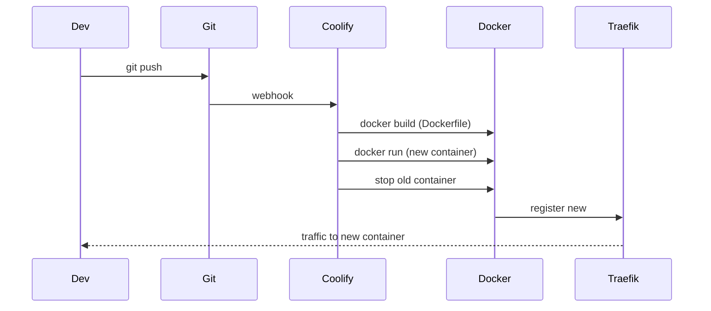

# 09 — Deployment & Operations

> Consolidated from docs/DEPLOY.md, docs/MIGRATIONS.md, database/migrations/README.md,
> docs/PRODUCTION_READINESS.md (§2–§6), README.
> **Current deployment:** Hetzner VPS (Ubuntu) + Coolify + Traefik · **Live:** https://testdemo.it

---

## Infrastructure overview

```
Internet
   ▼
Hetzner VPS (91.99.137.240)
   ├─ Coolify (control panel, port 8000)
   │    ├─ coolify-proxy (Traefik, ports 80/443, Let's Encrypt)
   │    ├─ App container (PHP 8.3 + Apache)
   │    └─ DB container  (MySQL 8, named "default")
   └─ Cloudflare DNS (testdemo.it → 91.99.137.240)
```

---

## DNS records (testdemo.it via Cloudflare)

| Type | Name | Value | Purpose |
|------|------|-------|---------|
| A | @ | 91.99.137.240 | Root → VPS |
| CNAME | www | testdemo.it | www redirect |
| TXT | @ | `v=spf1 include:mailgun.org ~all` | Mailgun SPF |
| TXT | smtp._domainkey | DKIM key from Mailgun | Mailgun DKIM |
| MX | mail | mxa.mailgun.org (10) | Mailgun inbound |
| MX | mail | mxb.mailgun.org (10) | Mailgun inbound |

Nameservers moved from GoDaddy to Cloudflare; all DNS is managed via Cloudflare.

---

## Environment variables (Coolify)

```env
APP_ENV=production
APP_DEBUG=false                     # ⚠️ must stay false (true leaks PHP errors into HTML partials)
APP_URL=https://testdemo.it
FORCE_HTTPS=true

DB_HOST=k6ctgb6t5pco3p4qabrgl8h3   # Coolify internal DB hostname
DB_PORT=3306
DB_NAME=default                     # ⚠️ Coolify names the DB "default", not gestione_immobiliare
DB_USER=root                        # ⚠️ liability — should be a least-privilege user in prod
DB_PASS=<coolify-generated>

SESSION_NAME=gi_session             # ⚠️ conflicts with ARCHITECTURE.md "gestionale_session" — verify live
CRON_SECRET=<64-char random hex>

AGENCY_NAME=Anije Immobiliare
AGENCY_EMAIL=noreply@mail.testdemo.it   # must be on verified Mailgun domain

SMTP_HOST=smtp.eu.mailgun.org       # EU region
SMTP_PORT=587
SMTP_SECURE=tls
SMTP_USER=postmaster@mail.testdemo.it
SMTP_PASS=<mailgun-smtp-pass>

TWILIO_ACCOUNT_SID=<sid>
TWILIO_AUTH_TOKEN=<token>
TWILIO_WHATSAPP_FROM=whatsapp:+14155238886   # sandbox

META_APP_ID=<id>
META_APP_SECRET=<secret>
META_PUBLIC_BASE_URL=https://testdemo.it     # required for Instagram image URLs

SETUP_ENABLED=false
ADMIN_PASSWORD=<strong>             # ⚠️ never leave as placeholder
```

Optional (backup, Stripe): `BACKUP_S3_ENDPOINT/BUCKET/KEY/SECRET/REGION`,
`STRIPE_PUBLIC_KEY/SECRET_KEY/WEBHOOK_SECRET`, `APP_SECRET`.

Config precedence: `app_settings` (DB, UI-editable) values override `.env` defaults;
`config/settings.php` merges and caches per request.

---

## Dockerfile summary

```dockerfile
FROM php:8.3-apache-bookworm
# Extensions: pdo_mysql, mbstring, gd, zip, intl, curl, fileinfo, json, openssl
# Apache: mod_rewrite, mod_headers enabled; AllowOverride All
# Multi-stage: COPY --from=composer:2 /usr/bin/composer ... ; RUN composer install --no-dev --optimize-autoloader
```

`docker-entrypoint.sh` reads `$PORT` and updates Apache's Listen directive before starting
(Coolify assigns a random proxy port). `vendor/` is git-ignored; `composer.lock` generated on
first Coolify build.

---

## Deployment workflow (Coolify)

1. Push to the connected Git branch.
2. Coolify auto-deploys (or click **Redeploy**).
3. Zero-downtime: new container starts before the old one stops; Traefik re-routes.
4. Check Coolify → Application → Logs on failure.



Traefik (`coolify-proxy`) handles HTTP→HTTPS redirect, Let's Encrypt cert, and the
`X-Forwarded-Proto` header the `FORCE_HTTPS` logic in `bootstrap.php` reads.

---

## Initial database setup

```bash
scp database/schema_production.sql root@91.99.137.240:/root/
ssh root@91.99.137.240
docker ps                                  # find the app container name
docker exec -i CONTAINER_NAME \
  mysql -h k6ctgb6t5pco3p4qabrgl8h3 -u root -p<DB_PASS> default \
  < /root/schema_production.sql
```

**Fresh production DB:** use `schema_production.sql` (no migrations needed). **Existing DB:**
run migrations in order.

---

## Database migrations

Located in `database/migrations/`. Idempotent from phase6 onward (`000_helpers.sql` defines
stored procedures like `migration_add_index`, safe to re-run). Phase 5/7 seed inserts run only
when related clients/properties exist.

**Documented run order (from README/MIGRATIONS.md):**
```bash
mysql -u USER -p < database/migrations/000_helpers.sql
mysql -u USER -p < database/migrations/phase3_property_media.sql
mysql -u USER -p < database/migrations/phase4_documents.sql
mysql -u USER -p < database/migrations/phase5_communications.sql
mysql -u USER -p < database/migrations/phase6_reminder_notifications.sql
mysql -u USER -p < database/migrations/phase7_social.sql
mysql -u USER -p < database/migrations/phase8_production.sql
mysql -u USER -p < database/migrations/phase9_features.sql
mysql -u USER -p < database/migrations/phase11_features.sql
mysql -u USER -p < database/migrations/phase12_features.sql
mysql -u USER -p < database/migrations/phase15_new_features.sql
```

> ⚠️ **The docs are stale.** The actual `database/migrations/` folder contains **more phases**
> than the README lists. Full on-disk set (run `000_helpers.sql` first, then ascending):
> `phase3_property_media`, `phase4_documents`, `phase5_communications`,
> `phase6_reminder_notifications`, `phase7_social`, `phase8_production`, `phase9_features`,
> `phase10_features`, `phase11_features`, `phase12_features`, `phase13_geocoding`,
> `phase14_email_templates`, `phase15_new_features`, `phase16_template_text_fix`,
> `phase17_property_gallery_enhance`, `phase18_frequencies_automations`,
> `phase19_reminders_maintenance_cols`, `phase20_commission_types`, `phase21_connections`,
> `phase22_integrity_fixes`, `phase23_id_card_doctypes`, `phase24_gap_fixes`,
> `phase25_property_delete_integrity`, `phase26_relationship_fixes`,
> `phase27_immobiliare_fields`, `phase28_contract_auto_status`.
>
> Notable content: phase13 geocoding; phase14 email templates; phase18 automations
> frequencies; phase19 maintenance columns on reminders; phase20 commission types; phase22
> FK-integrity fixes; phase23 ID-card doc types; phase24 gap fixes (incl. `reminders.tenant_id`
> FK); phase25/26 delete/relationship integrity; phase27 Immobiliare.it export fields; phase28
> contract auto-status. There is **no `schema_migrations` runner table** — SQL is applied
> manually.

---

## Cron jobs (VPS crontab)

Reported set up on `91.99.137.240` via `crontab -` (per GAPS.md). **Verify** with
`/var/log/gestione-cron.log`.

```cron
CONTAINER="<app-container-name>"
# Reminders + contract expirations
*/15 * * * * docker exec $CONTAINER php /var/www/html/cron/process_reminders.php
# Payment reminders (tenant rent)
0 8 * * *    docker exec $CONTAINER php /var/www/html/cron/send_payment_reminders.php
# Scheduled social posts
*/5 * * * *  docker exec $CONTAINER php /var/www/html/cron/publish_social_posts.php
# Contract expiration checks
0 9 * * *    docker exec $CONTAINER php /var/www/html/cron/process_contract_expirations.php
# Database backup
0 2 * * *    docker exec $CONTAINER php /var/www/html/cron/backup_database.php
```

HTTP alternative (with secret):
```bash
curl -X POST -H "X-Cron-Secret: <SECRET>" https://testdemo.it/api/process_reminders.php
```

---

## Local development

### Docker (recommended)
```powershell
cd "Gestione Immobiliare"
copy .env.docker.example .env.docker
.\scripts\docker-up.ps1            # or: docker compose up --build --watch
```
| Page | URL |
|------|-----|
| App | http://localhost:8090/ |
| Setup (first time) | http://localhost:8090/setup.php |
| Login | http://localhost:8090/login.php |

Live reload: `.\scripts\docker-up.ps1 watch`. Stop: `docker compose down`.
Local MySQL: `localhost:3306` (user `root`, pass `root`, db `gestione_immobiliare`).

> **OneDrive users:** use `scripts\docker-up.ps1` — it copies to `%LOCALAPPDATA%` before build
> to avoid Docker + OneDrive errors. Running Apache directly from a OneDrive path breaks on Windows.

### MAMP/XAMPP
Copy to web root → create DB + import schema/migrations → copy `.env.example`→`.env` with DB
creds → `SETUP_ENABLED=true`, run `setup.php`, then disable → open `index.php`.

### Server PHP requirements
Extensions: `pdo_mysql`, `curl`, `fileinfo`, `json`, `mbstring`, `openssl`; CLI + `mysqldump`
in PATH for backup cron. PHP **8.1+** (8.3 in prod). Apache needs `AllowOverride All`; on Nginx
the `.htaccess` block rules (`config/`, `database/`, etc.) must be rewritten manually.

---

## Production checklist (PRODUCTION_READINESS §2)

**P0 (blocking):** production env flags (`APP_ENV=production`, `APP_DEBUG=false`,
`FORCE_HTTPS=true`, `SETUP_ENABLED=false`); strong `APP_SECRET`/`CRON_SECRET`/admin password;
dedicated DB user (not root/root); migrations or updated schema; test data removed; setup
disabled (`setup.php`→403 + `.setup_complete`); TLS + `Secure` cookies; non-OneDrive host.
*(Marked done: tenant login bootstrap path fix; `requireWriteAccess()` on all mutating APIs;
`schema_production.sql` updated through phases 8–9.)*

**P1 (first week):** real SMTP + test send; server cron (not just UI trigger); cloud backup +
verify a file lands in the bucket; test a restore; Twilio webhook signature validation; Meta
App ID/Secret + OAuth redirect + `META_PUBLIC_BASE_URL`; authenticated proxy for sensitive
`uploads/`; SVG logo sanitisation.

**P2 (continuous):** CSRF on all forms; rate limiting on login + API; password reset; security
headers (HSTS, X-Frame-Options, CSP); structured logging + cron/backup alerts; health-check
endpoint; PHPUnit + CI; GDPR legal docs; back up `uploads/` files (currently DB only).

---

## Post-deploy smoke tests

| # | Test | Expected |
|---|------|----------|
| 1 | `/login.php` no session | Login form |
| 2 | Wrong admin login | Error, no access |
| 3 | Correct admin login | Redirect to dashboard |
| 4 | `/api/get_dashboard_stats.php` no cookie | 401 |
| 5 | `/views/dashboard.html` direct | 403 |
| 6 | `/config/db.php` direct | 403 |
| 7 | Create proprietario + immobile | Saved OK |
| 8 | Upload document | File in `uploads/documents/` |
| 9 | Test email from Settings | Received in **inbox**, not spam |
| 10 | Reminder cron (CLI or HTTP+secret) | JSON `success` |
| 11 | Backup cron | File in `backups/` (+ cloud if enabled) |
| 12 | Tenant portal login | Tenant dashboard |
| 13 | `SETUP_ENABLED=false` → `/setup.php` | 403 |
| 14 | From smartphone | Hamburger menu, card tables, full-width modals |

---

## Troubleshooting

| Symptom | Cause | Fix |
|---------|-------|-----|
| Default Apache page | DNS not propagated / A-record conflict | Check DNS, remove duplicate A records |
| `Uncaught SyntaxError` in JS console | PHP error output in HTML (`APP_DEBUG=true`) | Set `APP_DEBUG=false` |
| DB connection error | `DB_NAME` mismatch | Coolify DB is `default`, not `gestione_immobiliare` |
| SMTP auth fails | Wrong TLS method | `config/mail.php` uses `TLSv1_2_CLIENT | TLSv1_3_CLIENT` |
| Mailgun "domain unverified" | Missing MX records | Add MX for `mail.testdemo.it` |
| WhatsApp not saved | Wrong Twilio webhook URL | Must be `https://testdemo.it/api/whatsapp_webhook.php` |
| Container not found after redeploy | Renamed each deploy | `docker ps` for the new name |

---

## Alternative hosting notes

Options: Italian shared hosting (Aruba/SiteGround, PHP+MySQL included); VPS (Hetzner/
DigitalOcean); **Render** (Docker + external MySQL — `render.yaml` blueprint exists, but the
filesystem is **ephemeral** so uploads/backups need external object storage). MAMP is dev-only.
