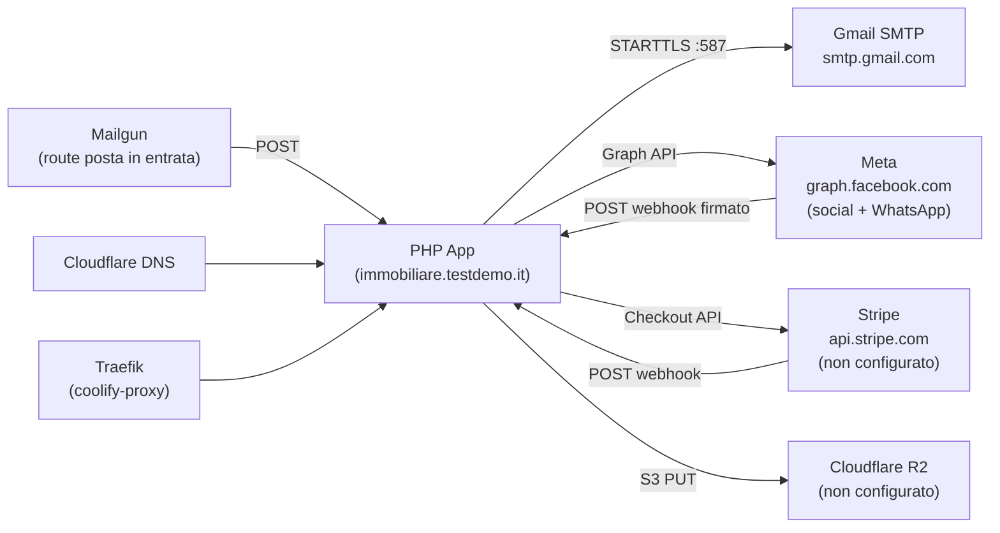

# Integrations — Gestione Immobiliare

Stato delle integrazioni verificato in produzione il **02/08/2026** via
`GET /api/readiness.php` (`overall: warn`). Le righe qui sotto sono misurate,
non dichiarate.

| Integration | Status | Config location |
|-------------|--------|-----------------|
| Email (SMTP) | OK — `smtp.gmail.com`, connessione e autenticazione riuscite | `app_settings` (**vince** sulle env var) |
| WhatsApp (Meta Cloud API) | Spento: `whatsapp_enabled = false`, invii simulati | env var **o** Impostazioni |
| Meta Graph (Facebook) | Codice funzionante, app in dev mode | `social_settings` |
| Meta Graph (Instagram) | Come sopra; richiede immagine + base pubblica (ora da `APP_URL`) | `social_settings` |
| Stripe (payments) | Chiavi non configurate **e** nessun endpoint di checkout lato inquilino | env var (nessuna UI) |
| Backup su cloud (S3/R2) | Non configurato. Il backup **locale** gira (ultimo ~18h) | env var `BACKUP_*` |
| Cron jobs | OK — tutti i job hanno un heartbeat recente | crontab sul server |
| Posta in **entrata** (Mailgun route) | Bloccata: manca `mailgun_webhook_key`, in produzione rifiuta il non firmato | env var **o** Impostazioni |

---

## 1. Mailgun (Email)

**Status:** ✅ Working  
**Provider:** Mailgun EU
**Code:** `config/mail.php`

### How it works

All outbound email goes through `sendClientEmail()` → `sendViaSmtp()`. The function opens a raw TCP socket, performs STARTTLS, authenticates, and sends RFC 2822-formatted email manually (no PHPMailer dependency).

### Configuration

| Env var | Value | Notes |
|---------|-------|-------|
| `SMTP_HOST` | `smtp.eu.mailgun.org` | **EU region** — not `smtp.mailgun.org` |
| `SMTP_PORT` | `587` | STARTTLS |
| `SMTP_SECURE` | `tls` | Triggers STARTTLS path |
| `SMTP_USER` | `postmaster@mail.testdemo.it` | Mailgun SMTP user |
| `SMTP_PASS` | `(Mailgun SMTP password)` | From Mailgun dashboard |
| `AGENCY_EMAIL` | `noreply@mail.testdemo.it` | **Must be on verified sending domain** |

### DNS records required

| Type | Host | Value |
|------|------|-------|
| TXT | @ | `v=spf1 include:mailgun.org ~all` |
| TXT | smtp._domainkey.mail | DKIM public key from Mailgun |
| MX | mail | mxa.mailgun.org (priority 10) |
| MX | mail | mxb.mailgun.org (priority 10) |

### Critical bug fix applied

The original code used `STREAM_CRYPTO_METHOD_TLS_CLIENT` which is deprecated and fails against modern SMTP servers. Fixed in `config/mail.php` line 90:

```php
// ❌ Old (fails with TLS handshake error)
stream_socket_enable_crypto($socket, true, STREAM_CRYPTO_METHOD_TLS_CLIENT);

// ✅ Fixed
stream_socket_enable_crypto($socket, true, STREAM_CRYPTO_METHOD_TLSv1_2_CLIENT | STREAM_CRYPTO_METHOD_TLSv1_3_CLIENT);
```

### Known gaps

- No retry logic — if SMTP fails, the message is lost (not queued)
- No bounce/delivery webhook handling from Mailgun
- `AGENCY_EMAIL` must be on a Mailgun-verified domain; using a Gmail address as FROM causes rejection

---

## 2. WhatsApp — Meta Cloud API

**Status:** configurato nel codice, **spento in produzione** (`whatsapp_enabled = false`):
gli invii vengono registrati come "simulati", non spediti.
**Code:** `config/whatsapp.php`, `api/whatsapp_webhook.php`, `api/whatsapp_inbox.php`

Twilio e' stato rimosso (01/08/2026): rivendeva questa stessa piattaforma Meta
aggiungendo una tariffa per messaggio. Ora si chiama Meta direttamente, quindi
non esistono piu' `TWILIO_ACCOUNT_SID`, `TWILIO_AUTH_TOKEN`,
`TWILIO_WHATSAPP_FROM` — se sono ancora nell'ambiente, non li legge nessuno.

### Architecture

```
Outbound: PHP -> graph.facebook.com (Bearer token) -> WhatsApp
Inbound:  WhatsApp -> Meta -> POST /api/whatsapp_webhook.php (JSON firmato HMAC) -> MySQL
```

### Outbound flow

`sendWhatsAppMessage($to, $body)` in `config/whatsapp.php`:
1. Legge `whatsapp_enabled` (se false, simula il successo e non chiama nessuno)
2. `POST /{phone_number_id}/messages` su Graph, autenticato `Authorization: Bearer`
3. Salva in `communications` con `channel = whatsapp`

`phone_number_id` **non e' il numero**: e' l'identificativo che Meta assegna al
mittente ed e' l'unica cosa che finisce nell'URL. `WHATSAPP_FROM` serve solo a
mostrare il mittente in archivio e in chat.

Fuori dalle 24 ore dall'ultimo messaggio del cliente, Meta accetta **solo
template approvati**: vedi `sendWhatsAppTemplate()`. Gli errori 131047/131051/
131026 significano "finestra chiusa", non "guasto".

### Inbound flow

Un solo endpoint, due metodi:
- **GET** — la verifica con cui Meta attiva la sottoscrizione. Va restituita la
  `hub.challenge` in chiaro, altrimenti il webhook non si attiva mai e non
  arriva un solo messaggio, senza errori visibili da questa parte.
- **POST** — messaggi in arrivo **e** stati di consegna dei nostri, che con
  Twilio erano un endpoint separato.

Firma HMAC-SHA256 del corpo grezzo con `META_WA_APP_SECRET`. **Fail closed in
produzione:** senza app secret il webhook risponde `503` e rifiuta tutto —
WhatsApp sembrerebbe attivo e non arriverebbe niente.

URL da incollare nel pannello Meta:
`https://immobiliare.testdemo.it/api/whatsapp_webhook.php` (sottoscrivere il
campo `messages`).

### Configuration

Tutte le chiavi si possono impostare **o** da ambiente **o** da Impostazioni.
Attenzione alla precedenza: **una riga in `app_settings` vince sull'ambiente**
(la pagina Impostazioni batte Coolify). Se una variabile sembra non avere
effetto, e' perche' esiste gia' la riga corrispondente.

| Env var | Chiave Impostazioni | Valore |
|---------|--------------------|--------|
| `WHATSAPP_ENABLED` | `whatsapp_enabled` | `true` per spedire davvero |
| `META_WA_PHONE_NUMBER_ID` | `meta_wa_phone_number_id` | id del mittente, solo cifre |
| `META_WA_ACCESS_TOKEN` | `meta_wa_access_token` | token **permanente** (System User) |
| `META_WA_APP_SECRET` | `meta_wa_app_secret` | firma i webhook in arrivo |
| `META_WA_VERIFY_TOKEN` | `meta_wa_verify_token` | stringa scelta da te, ripetuta nel pannello |
| `WHATSAPP_FROM` | `whatsapp_from` | `+393331234567`, formato internazionale |

Con `whatsapp_enabled` attivo, il salvataggio delle Impostazioni **rifiuta** un
salvataggio in cui uno qualsiasi degli altri cinque e' vuoto.

### Known gaps

- Un token di sviluppo dura 24 ore: scaduto, ogni invio muore con **errore 190**.
  Serve un token permanente da System User.
- Finche' l'app Meta e' in **sviluppo**, si scrive solo ai numeri di prova
  (errore **131030** verso chiunque altro).
- I template vanno approvati da Meta prima di poter scrivere fuori dalle 24 ore.

---

## 3. Meta Graph API (Facebook + Instagram)

**Status:** ✅ Working  
**Code:** `config/meta.php`, `meta_oauth.php`, `meta_callback.php`

### OAuth flow

```
1. Admin clicks "Connetti Facebook" in Settings
2. meta_oauth.php redirects to Meta with scopes:
   - pages_manage_posts
   - pages_read_engagement
   - instagram_basic
   - instagram_content_publish
3. Meta redirects back to meta_callback.php?code=...
4. callback exchanges code for user_access_token
5. Fetches page list + page_access_tokens
6. Fetches Instagram account linked to the page
7. Stores everything in social_settings table
```

### Publishing flow

`publishSocialPost($post)` in `config/meta.php`:

**Facebook:**
- `POST /{page_id}/feed` with `message` and optionally `link`
- Works with text only

**Instagram:**
- Step 1: `POST /{ig_account_id}/media` with `image_url` (must be a public HTTPS URL) + `caption`
- Step 2: `POST /{ig_account_id}/media_publish` with `creation_id` from step 1
- **Requires:** `image_path` set on the post AND `META_PUBLIC_BASE_URL` env var

### Selecting an image for Instagram posts

In the social posts modal, the user must:
1. Select a property (images appear as thumbnails)
2. **Click a thumbnail** to select it — this sets the `post-property-media-id` hidden input
3. Just viewing thumbnails is NOT enough — a click is required

### Configuration

| Env var | Purpose |
|---------|---------|
| `META_APP_ID` | Meta developer app ID |
| `META_APP_SECRET` | Meta app secret |
| `META_PUBLIC_BASE_URL` | Base URL for serving images to Instagram (must be public HTTPS) |

OAuth tokens are stored in `social_settings` table (not env vars).

### Known gaps

- **Token expiration** — Meta user tokens expire (~60 days). No automatic refresh. Admin must reconnect manually via Settings → Social.
- **Advanced access required for production** — currently uses Development mode (works for own accounts only). For posting to public pages and external audiences, the app needs Meta App Review.
- **Instagram text-only not supported** — Instagram requires an image. Facebook works without one.
- No video post support

---

## 4. Stripe (Online Payments)

**Status:** ⚠️ Code exists, not configured  
**Code:** `api/stripe_checkout.php`, `api/stripe_webhook.php`

### What's implemented

- Checkout session creation (`stripe_checkout.php`)
- Webhook handler for `checkout.session.completed` (`stripe_webhook.php`)
- `stripe_payments` table for tracking Stripe-specific payment data

### What's needed to activate

1. Add Stripe env vars to Coolify:
   ```
   STRIPE_PUBLIC_KEY=pk_live_...
   STRIPE_SECRET_KEY=sk_live_...
   STRIPE_WEBHOOK_SECRET=whsec_...
   ```
2. Register webhook in Stripe dashboard → `https://testdemo.it/api/stripe_webhook.php`
3. Events: `checkout.session.completed`, `payment_intent.payment_failed`

### Known gaps

- No UI for tenants to initiate payment (tenant portal would need a "Pay now" button)
- Stripe webhook secret validation should use `Stripe\Webhook::constructEvent()` (requires Stripe PHP SDK)
- Currently the Stripe PHP SDK may not be installed (`composer.json` should be checked)

---

## 5. Cloudflare R2 / S3 Backup

**Status:** 🔄 In progress  
**Code:** `config/backup_cloud.php`, `cron/backup_database.php`

### Plan

- Cloudflare R2 bucket (S3-compatible) for database dump backups
- Nameservers already migrated to Cloudflare ✅
- R2 bucket not yet created

### What's needed

1. Create R2 bucket in Cloudflare dashboard
2. Generate R2 API credentials (Access Key ID + Secret)
3. Add to Coolify env vars:
   ```
   BACKUP_S3_ENDPOINT=https://<account_id>.r2.cloudflarestorage.com
   BACKUP_S3_BUCKET=gestione-immobiliare-backups
   BACKUP_S3_KEY=<r2-access-key-id>
   BACKUP_S3_SECRET=<r2-secret-key>
   BACKUP_S3_REGION=auto
   ```
4. Set up `cron/backup_database.php` cron job (see DEPLOY.md)

---

## 6. Cron jobs

**Status:** ⚠️ Not configured on production server  
**Code:** `cron/` directory

All cron scripts use `config/cron_bootstrap.php` (no web session auth). They can be triggered:
- Via CLI: `php cron/process_reminders.php`
- Via HTTP with secret: `GET /api/process_reminders.php?secret=<CRON_SECRET>`

See DEPLOY.md for the full crontab setup instructions.

---

## Integration dependency map


